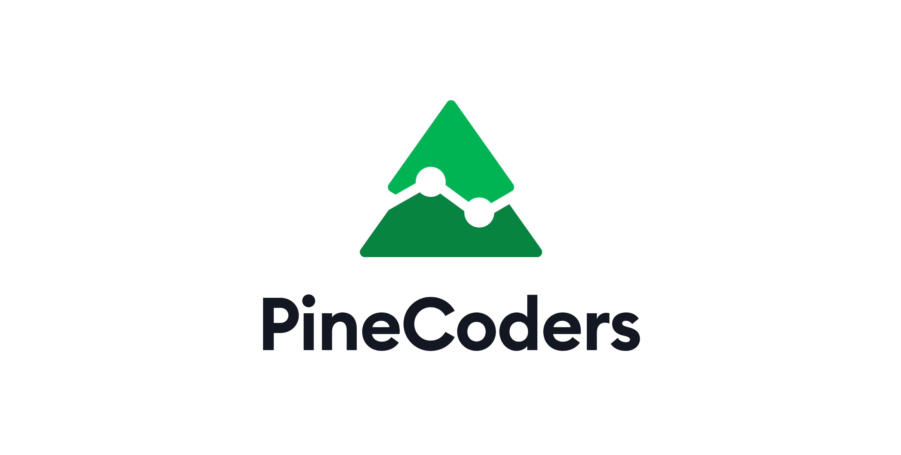

<!-- Global site tag (gtag.js) - Google Analytics -->

<link rel="icon" href="http://pinecoders.com/favicon.ico?v=2" />

<strong>New to Pine?</strong> 
Begin your journey with our <a href="http://www.pinecoders.com/learning_pine_roadmap">Learning Pine Roadmap</a>.  

<strong>Have a question on Pine?</strong> 
Your answer is probably already in our <a href="http://www.pinecoders.com/faq_and_code">FAQ & Code</a>. 
If not, look up the <a href="https://www.tradingview.com/pine-script-reference/v4/">Reference Manual</a>, the <a href="https://www.tradingview.com/pine-script-docs/en/v4/Introduction.html">User Manual</a>, or search the Web. 
As a last resort, ask in the <a href="https://www.tradingview.com/chat/#BfmVowG1TZkKO235">Pine Script chat room</a> on TradingView, or on <a href="https://stackoverflow.com/questions/tagged/pine-script?tab=Newest">Stack Overflow</a>.  

<strong>Want to learn proper Pine coding style?</strong> 
Read our <a href="http://www.pinecoders.com/coding_conventions">Pine Coding Conventions</a>.  

<strong>Want to stay abreast of Pine news?</strong> 
Subscribe to our <a href="https://t.me/PineCodersSquawkBox">PineCoders Squawk Box on Telegram</a>, or follow our <a href="https://twitter.com/PineCoders">Twitter account</a>.  

<strong>Looking for a professional Pine programmer?</strong> 
See our <a href="https://www.pinecoders.com/resources/#trusted-pine-programmers-for-hire">Trusted Pine Programmers for Hire</a>.  

<strong>Looking for more resources on Pine?</strong> 
Use our <a href="http://www.pinecoders.com/resources">Pine Resources</a>.  

<strong>Want to make a suggestion to improve Pine, or report a bug?</strong> 
Send it by email to our <a href="https://trello.com/c/QA6bcL7l">Trello board</a>.  

<strong>Interested in broadening your vistas?</strong> 
We have a guide on <a href="http://www.pinecoders.com/techniques/dsp">Digital Signal Processing in Pine</a> and a <a href="http://www.pinecoders.com/books">list of books</a>.

---

PineCoders is a [TradingView](https://www.tradingview.com/)-supported group of programmers who code in [Pine Script](https://www.tradingview.com/pine-script-docs/en/v4/Introduction.html), which is used to write trading indicators and strategies for the TradingView financial charting platform.

We collaborate with TradingView's Pine team to steer the future of the language and make Pine indicators and strategies easier to use for the at-large TV community of traders.

We pilot the [PineCoders](https://www.tradingview.com/u/PineCoders/#published-charts) moderator account on TV, from where we moderate scripts published in the [Public Library](https://www.tradingview.com/scripts/), answer questions in the [Pine Script chat](https://www.tradingview.com/chat/#BfmVowG1TZkKO235), publish [open source tools and examples in Pine](https://www.tradingview.com/u/PineCoders/#published-scripts), and follow [leading publishers](https://www.tradingview.com/u/PineCoders/#following-people) of open-source scripts on TV.

[Pine v4 Reference Manual](https://www.tradingview.com/pine-script-reference/v4/)  
[Pine v4 User Manual](https://www.tradingview.com/pine-script-docs/en/v4/Introduction.html)

