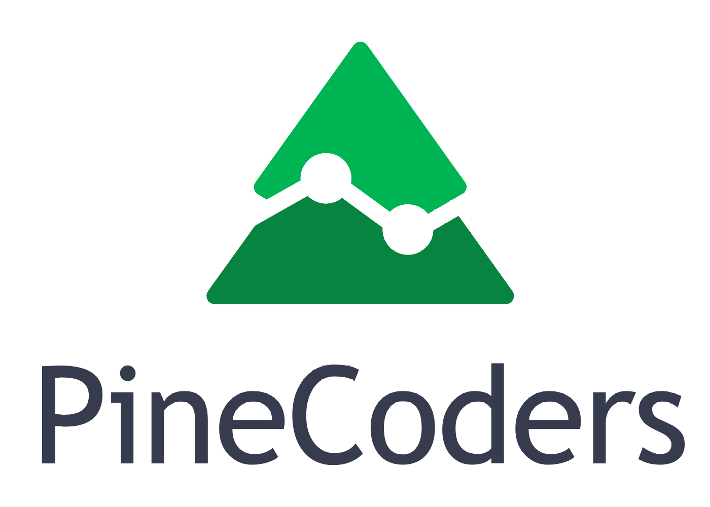

PineCoders is a TradingView-supported group of programmers using TradingView's Pine script language. We help TV users learn the Pine programming language, provide tools and resources for beginning as well as pro coders, and we collaborate with TradingView to make using Pine indicators and strategies easier for both coders and the general TV community.

We co-manage with TradingView the [Suggestions For Improvements To Pine](https://trello.com/b/Jmv6c8Cx) Trello Board. This Trello [card](https://trello.com/c/r0jKAKhK) explains how the board works, how any Trello user can comment/vote on suggestions and how to make new suggestions.

We operate the [PineCoders](https://www.tradingview.com/u/PineCoders/#published-scripts) TV moderator account, from which we answer questions in the [Pine Script TV chat](https://www.tradingview.com/chat/#BfmVowG1TZkKO235), publish open source tools and examples in Pine, and from where we follow [top publishers](https://www.tradingview.com/u/PineCoders/#following-people) of mostly open source scripts on TV who's code you can learn much from.

We manage an [open source repository](https://github.com/pinecoders/pine-utils) of Pine code where you will find:
- [Snippets](https://github.com/pinecoders/pine-utils/tree/master/snippets) of reusable Pine code
- Tricks and techniques to help you accomplish frequently needed tasks
- Other open source projects related to Pine

Guides:
- Learning Pine Roadmap
- Pine FAQ & Code
- Pine Coding Conventions.
