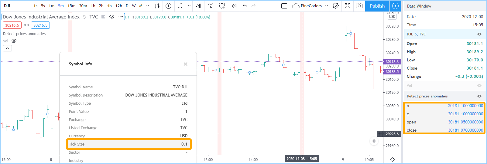
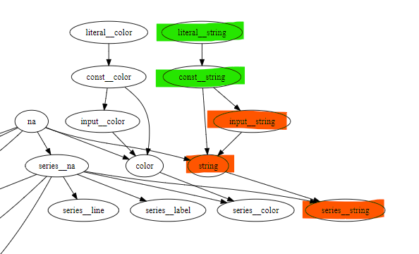
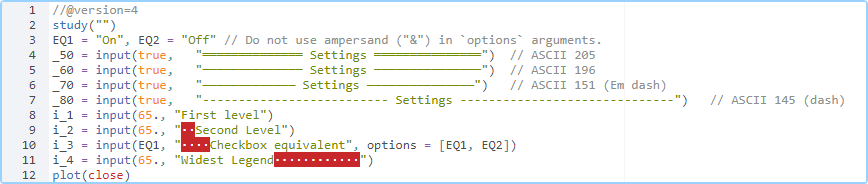
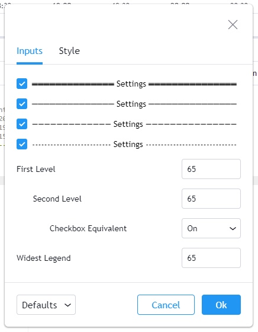

<!-- Global site tag (gtag.js) - Google Analytics -->
<script async src="https://www.googletagmanager.com/gtag/js?id=UA-147975914-1"></script>
<script>
  window.dataLayer = window.dataLayer || [];
  function gtag(){dataLayer.push(arguments);}
  gtag('js', new Date());

  gtag('config', 'UA-147975914-1');
</script>

[](https://www.pinecoders.com/)

# FAQ & Code

This is a compendium of frequently asked questions on Pine. Answers often give code examples or link to the best sources on the subject.

Do not make the mistake of assuming this is strictly beginner's material; some of the questions and answers explore advanced techniques.

> **Reusing this code**: You are welcome to reuse this code in your scripts. No permission is required from PineCoders. Credits are appreciated.

### Table of Contents

- [Built-in variables](#built-in-variables)
- [Built-in functions](#built-in-functions)
- [Operators](#operators)
- [Math](#math)
- [Indicators (a.k.a. studies)](#indicators)
- [Strategies](#strategies)
- [Plotting](#plotting)
- [Labels and Lines](#labels-and-lines)
- [Time, dates and Sessions](#time-dates-and-sessions)
- [Other Timeframes (MTF)](#other-timeframes-mtf)
- [Alerts](#alerts)
- [Editor](#editor)
- [Techniques](#techniques)
- [Debugging](#debugging)

<br><br>
## BUILT-IN VARIABLES


### What is the variable name for the current price? 
The `close` variable holds both the price at the close of historical bars and the current price when an **indicator** is running on the realtime bar. If the script is a **strategy** running on the realtime bar, by default it runs only at the bar's close. If the `calc_on_every_tick` parameter of the `strategy()` declaration statement is set to `true`, the strategy will behave as an indicator and run on every price change of the realtime bar.

To access the close of the previous bar's close in Pine, use `close[1]`. In Pine, brackets are used as the [history-referencing operator](https://www.tradingview.com/pine-script-docs/en/v4/language/Operators.html#history-reference-operator).

### What is the code for an up bar?
```js
upBar = close > open
```
Once you have defined the `upBar` variable, if you wanted a boolean variable to be `true` when the last three bars were up bars, you could write:
```js
threeUpBars = upBar and upBar[1] and upBar[2]
```
You could also achieve the same using:
```js
threeUpBars = sum(upBar ? 1 : 0, 3) == 3
```
which produces a value of `1` every time the `upBar` boolean variable is true, and adds the number of those values for the last 3 bars. When that rolling sum equals `3`, `threeUpBars` is true.
> Note that the variable name `3UpBars` would have caused a compilation error. It is not legal in Pine as it begins with a digit.

If you wanted to have a condition true when there were 7 or more up bars in the last 10, you could use:
```js
sevenUpBarsInLastTen = sum(upBar ? 1 : 0, 10) >= 7
```
If you need to define up and down bars and want to account for all possibilities, make sure one of those definitions allows for the case where `open` and `close` are equal:
```js
upBar = close > open
dnBar = not upBar
```
In this case, when `close == open`, `upBar` will be false and `dnBar` true.

### Why do the OHLC built-ins sometimes return different values than the ones shown on the chart?
Data feeds sometimes contains prices that exceed the symbol's tick precision. When this happens, the value returned by the `close` built-in may be different from the chart's close value. Chart prices are always rounded to tick precision, but built-ins are not. This makes it possible for occurrences like the one illustrated here, where the exchange feed contains a close price of 27491.79 that is more precise than the symbol's `0.1` tick size. In that case, the chart will show 27491.8 but the `close` built-in's value will be the feed's value: 27491.79.

The difference is subtle but such discrepancies do occur and should be taken into consideration when troubleshooting unexpected script behavior or designing precision-critical calculations. Cross detections are an example of calculations that can be affected.

One solution is to force a rounding of OHLC built-ins and use the rounded values in further calculations, as is done in this example script, which spots discrepancies between the evaluation of the `open == close` conditional expression with and without rounded values:
```js
//@version=4
study("My Script", overlay = true, precision = 10)
f_roundToTick( _price) => round(_price / syminfo.mintick) * syminfo.mintick
o = f_roundToTick(open)
c = f_roundToTick(close)
bgcolor(o == c and open != close ? color.red : na)
plotchar(o, "o", "", location.top, size = size.tiny)
plotchar(c, "c", "", location.top, size = size.tiny)
plotchar(open, "open", "", location.top, size = size.tiny)
plotchar(close, "close", "", location.top, size = size.tiny)
```


**[Back to top](#table-of-contents)**


<br><br>
## BUILT-IN FUNCTIONS


### Why do I get an error message when using `highest()` or `lowest()`?
Most probably because you are trying to use a series integer instead of a simple integer as the second parameter (the length). Either use a [simple integer](https://www.tradingview.com/pine-script-docs/en/v4/language/Type_system.html#simple) or use the [RicardoSantos](https://www.tradingview.com/u/RicardoSantos/#published-scripts) replacements [here](https://www.tradingview.com/script/32ohT5SQ-Function-Highest-Lowest/). If you don't know Ricardo, take the time to look at his indicators while you're there. Ricardo is among the most prolific and ingenious Pine coders out there.

### How can I work with arrays in Pine?
There is currently no array data type in Pine. RicardoSantos has some pseudo-array code [here](https://www.tradingview.com/script/sQxpiBL8-RS-Function-Pseudo-Array-Example/).

### How can I use a variable length argument in certain functions ?
The `sma`, `variance`, `stdev`, `correlation` functions don't allow a **series** as their length argument which must be a **simple int**. The following equivalent functions by [alexgrover](https://www.tradingview.com/u/alexgrover/) allow you to use a series as the length argument (see the complete code in his [Functions Allowing Series As Length](https://www.tradingview.com/script/kY5hhjA7-Functions-Allowing-Series-As-Length-PineCoders-FAQ/) script):

```
Sum(src,p) => a = cum(src), a - a[p]

Sma(src,p) => a = cum(src), (a - a[p])/p

Variance(src,p) => p == 1 ? 0 : Sma(src*src,p) - pow(Sma(src,p),2)

Stdev(src,p) => p == 1 ? 0 : sqrt(Sma(src*src,p) - pow(Sma(src,p),2))

Covariance(x,y,p) => Sma(x*y,p) - Sma(x,p)*Sma(y,p)

Correlation(x,y,p) => Covariance(x,y,p)/(Stdev(x,p)*Stdev(y,p))
```

If `p` is a decimal number then `p` is automatically rounded to the nearest integer. Most of the functions in the script are dependent on the `Sma` function except `Sum`, therefore if you want to use a function don't forget to include the `Sma` function in your script. The rolling correlation `Cor` make use of the `Cov` and `Stdev` function, so you must include them if you plan to use `Cor`.

Make sure the series you use as length argument is greater than 0, else the functions will return `na`. When using a series as length argument, the following error might appear : *Pine cannot determine the referencing length of a series. Try using max_bars_back in the study or strategy function*, this can be frequent if you plan to use `barssince(condition)` where `condition` is a relatively rare event. You can fix it by making use of `max_bars_back` as follows :

`study("Title",overlay=true,max_bars_back=5000)`

*Note that the rolling variance/standard deviation/covariance are computed using the naïve algorithm.*

### Why do some functions and built-ins evaluate incorrectly in ``if`` or ternary (``?``) blocks?

An important change to the way conditional statement blocks are evaluated was introduced with v4 of Pine. Many coders are not aware of it or do not understand its implications. [This User Manual section](https://www.tradingview.com/pine-script-docs/en/v4/language/Functions_and_annotations.html#execution-of-pine-functions-and-historical-context-inside-function-blocks) explains the change and provides a list of [exceptions](https://www.tradingview.com/pine-script-docs/en/v4/language/Functions_and_annotations.html#exceptions) for functions/built-ins which are NOT affected by the constraints. We'll explain what's happening here, and how to avoid the problems caused by code that does not take the change into account.

This is what's happening:
1. Starting in Pine v4, both blocks of conditional statements are no longer executed on every bar. By *both blocks*, we mean the part executed when the conditional expression evaluates to true, and the one (if it exists) to be executed when the expression evaluates to false.
2. Many functions/built-ins need to execute on every bar to return correct results. Think of a rolling average like ``sma()`` or a function like ``highest()``. If they miss values along the way, it's easy to see how they won't calculate properly.

This is the PineCoders "If Law":
> Whenever an if or ternary's (``?``) conditional expression can be evaluated differently bar to bar, all functions used in the conditional statement's blocks not in the list of exceptions need to be pre-evaluated prior to entry in the if statement, to ensure they are executed on each bar. 

While this can easily be forgotten in the creative excitement of coding your latest idea, you will save yourself lots of pain by understanding and remembering this. This is a major change from previous versions of Pine. It has far-reaching consequences and not structuring code along these lines can have particularly pernicious consequences because the resulting incorrect behavior is sometimes discrete (appearing only here and there) and random.

To avoid problems, you need to be on the lookout for 2 conditions:

#### Condition A  
A conditional expression that can only be evaluated with incoming, new bar information (i.e., using series variables like close). This excludes expressions using values of literal, const, input or simple forms because they do not change during the script's execution, and so when you use them, the same block in the if statement is guaranteed to execute on every bar. [Read this](https://www.tradingview.com/pine-script-docs/en/v4/language/Type_system.html) if you are not familiar with Pine forms and types.]

#### Condition B  
When condition A is met, and the if block(s) contain(s) functions or built-ins NOT in the list of exceptions, i.e., which require evaluation on every bar to return a correct result, then condition B is also met.

This is an example where an apparently inoffensive built-in like ``vwap`` is used in a ternary. ``vwap`` is not in the list of exceptions, and so when condition A is realized, it will require evaluation prior to entry in the if block. You can flip between 3 modes: #1 where condition A is fulfilled and #2 and #3 where it is not. You will see how the unshielded value ("upVwap2" in the thick line) will produce incorrect results when mode 1 is used.

```js
//@version=4
study("When to pre-evaluate functions/built-ins", "", true)
CN1 = "1. Condition A is true because evaluation varies bar to bar"
CN2 = "2. Condition A is false because `timeframe.multiplier` does not vary during the script's execution"
CN3 = "3. Condition A is false because an input does not vary during the script's execution"
useCond = input(CN1, "Test on conditional expression:", options = [CN1, CN2, CN3])
p = 10

// ————— Conditional expression 1: CAUTION!
//       Can lead to execution of either `if` block because:
//          uses *series* variables, so result changes bar to bar.
//       (Condition A is fulfilled).
cond1 = close > open
// ————— Conditional expression 2: NO WORRIES
//       Guarantees execution of same `if` block on every bar because:
//          uses *simple* variable, so result does NOT change bar to bar
//          because it is known before the script executes and does not change.
//       (Condition A is NOT fulfilled).
cond2 = timeframe.multiplier > 0
// ————— Conditional expression 3: NO WORRIES
//       Guarantees execution of same `if` block on every bar because:
//          uses *input* variable, so result does NOT change bar to bar
//          because it is known before the script execcutes and does not change.
//       (Condition A is NOT fulfilled).
cond3 = input(true)

cond = useCond == CN1 ? cond1 : useCond == CN2 ? cond2 : cond3

// Built-in used in 'if' blocks that is not part of the exception list,
// and so will require forced evaluation on every bar prior to entry in 'if' statement.
// (Condition B will be true when Condition A is also true)
v = vwap
// Shielded against condition B because vwap is pre-evaluted.
upVwap = sum(cond ? v : 0, p) / sum(cond ? 1 : 0, p)
// NOT shielded against condition B because vwap is NOT pre-evaluted.
upVwap2 = sum(cond ? vwap : 0, p) / sum(cond ? 1 : 0, p)

plot(upVwap, "upVwap", color.fuchsia)
plot(upVwap2, "upVwap2", color.fuchsia, 8, transp = 80)
bgcolor(upVwap != upVwap2 ? color.silver : na)
```


**[Back to top](#table-of-contents)**


<br><br>
## OPERATORS


### What's the difference between `==`, `=` and `:=`?
`==` is a [comparison operator](https://www.tradingview.com/pine-script-docs/en/v4/language/Operators.html#comparison-operators) used to test for true/false conditions.<br>
`=` is used to [declare and initialize variables](https://www.tradingview.com/pine-script-docs/en/v4/language/Expressions_declarations_and_statements.html#variable-declaration).<br>
`:=` is used to [assign values to variables](https://www.tradingview.com/pine-script-docs/en/v4/language/Expressions_declarations_and_statements.html#variable-assignment) after initialization, transforming them into *mutable variables*.
```js
//@version=3
study("")
a = 0
b = 1
plot(a == 0 ? 1 : 2)
plot(b == 0 ? 3 : 4, color = orange)
a := 2
plot(a == 0 ? 1 : 2, color = aqua)
```

### Can I use the `:=` operator to assign values to past values of a series?
No. Past values in Pine series are read-only, as is the past in real life. Only the current bar instance (`variableName[0]`) of a series variable can be assigned a value, and when you do, the `[]` history-referencing operator must **not** be used—only the variable name.

What you can do is create a series with the values you require in it as the script is executed, bar by bar. The following code creates a new series called `range` with a value containing the difference between the bar's `close` and `open`, but only when it is positive. Otherwise, the series value is zero.
```js
range = close > open ? close - open : 0.0
```
In the previous example, we could determine the value to assign to the `range` series variable as we were going over each bar in the dataset because the condition used to assign values was known on that bar. Sometimes, you will only obtain enough information to identify the condition after a number of bars have elapsed. In such cases, a `for` loop must be used to go back in time and analyse past bars. This will be the case in situations where you want to identify fractals or pivots. See the [Pivots Points High/Low](https://www.tradingview.com/pine-script-docs/en/v4/essential/Drawings.html#pivot-points-high-low) from the User Manual, for example.

### Why do some logical expressions not evaluate as expected when na values are involved?
Pine logical expressions have 3 possible values: `true`, `false` and `na`. Whenever an `na` value is used in a logical expression, the result of the logical expression will be na. Thus, contrary to what could be expected, `na == na`, `na == true`, `na == false` or `na != true` all evaluate to `na`. Furthermore, when a logical expression evaluates to `na`, the false branch of a conditional statement will be executed. This may lead to unexpected behavior and entails that special cases must be accounted for if you want your code to handle all possible logical expression results according to your expectations.

Let's take a case where, while we are debugging code, we want to compare two variables that should always have the same value, but where one of the variables or both can have an na value. When that is the case, neither `a == b` nor `a != b` will return true or false, as they both return na.

When we undestand this, we can see why the first `bgcolor()` line in the following code shows no background. While you could expect the `a != b` logical expression to be true and thus the background to appear lime because the value of variable `a` does not equal the value of `b`, this is not the case. Because the logical expression returns `na`, the false branch of the ternary is executed and no color is plotted in the background.

The second `bgcolor()` line will produce the behavior we expect. You will see this if you comment out the first one and uncomment this second line. The other lines show different variations of the concept.
```js
//@version=4
study("")
int a = 1
int b = na
bgcolor(a != b ? color.lime : na, transp = 20) // na, so goes to false branch.
// bgcolor(a == b ? na : color.red, transp = 20) // na, so goes to false branch.
// bgcolor(na((a != b)) ? color.orange : na, transp = 20) // true, so works.
// bgcolor(a != b or na(a != b) ? color.fuchsia : na, transp = 20) // true, so works.
```
This code shows a more practical example using a test for pivots.

```js
//@version=4
study("Logical expressions evaluate to true, false or na", "", precision=10)
// Truncated Stoch RSI built-in
smoothK = input(3, minval=1)
lengthRSI = input(14, minval=1)
lengthStoch = input(14, minval=1)
src = input(close, title="RSI Source")
capMin = input(false)
showEquals = input(true)
rsi1 = rsi(src, lengthRSI)
kCapped = max(10e-10, sma(stoch(rsi1, rsi1, rsi1, lengthStoch), smoothK))
kNormal = sma(stoch(rsi1, rsi1, rsi1, lengthStoch), smoothK)
k = capMin ? kCapped : kNormal
plot(k, color=color.blue)
hline(0, "", color.gray)
pLo = pivotlow(k, 1, 1)

// Usual way which doesn't work when a pivot occurs at value 0.
var usualSignal = 0.
if pLo
    usualSignal := 85
else
    // Note that this else clause catches all non-true values, so both 0 (false) AND na values.
    usualSignal := 15
plot(usualSignal, "Usual Signal", color.teal, 10, transp = 10)

// Bad way because we're comparing the pivot's value to 1 (true) and 0 (false), 
// so the logical expressions will only be true if a pivot occurs at those values, which is almost never.
var badSignal = 0.
if pLo == true
    // This conditions only catches pivots when they occur at value == 1, so almost never happens.
    badSignal := 85
else
    // This conditions only catches pivots when they occur at value == 0, so almost never happens.
    if pLo == false
        badSignal := 15
    else
        // This catches all the rest of conditions, which is almost always.
        badSignal := 50
plot(badSignal, "Bad Signal", color.purple, 10, transp = 60)

// Proper way to test so that we do not miss any pivots.
var goodSignal = 0.
if not na(pLo)
    // This identifies all pivot occurrences (including at value == 0) because it tests for values that are not na.
    goodSignal := 85
else
    goodSignal := 15
plot(goodSignal, "Good Signal", color.orange, 2, transp = 0)
    
// Our background color also misses pivots when they occur at value == 0.
bgcolor(pLo ? color.red : na, transp = 70)

// This line identifies pivots which occur at value == 0.
plotchar(not na(pLo) and pLo == 0., "", "•", location.top, color.fuchsia, 0, text = "Missed\nlow pivot", textcolor = color.new(color.red, 0), size = size.small)

// Debugging plots for Data Window.
plotchar(pLo, "pLo", "", location.top)
plotchar(pLo == true, "pLo == true", "", location.top)
plotchar(pLo == false, "pLo == false", "", location.top)
plotchar(na(pLo), "na(pLo)", "", location.top)
plotchar(true, "true", "", location.top)
plotchar(false, "false", "", location.top)
```


**[Back to top](#table-of-contents)**

## MATH

### How can I round a number to *x* increments?
```js
//@version=4
study("Round fraction")
i_val = input(0.75, "Value to round", step = 0.01)
i_to  = input(0.75, "Increment", step = 0.01)

f_roundTo(_val, _to) =>
    // Kudos to @veryevilone for the idea.
    round(_val / _to) * _to

plot(f_roundTo(i_val, i_to))
plot(f_roundTo(close, i_to))
```

### How can I control the number of decimals used in displaying my script's values?
Rounding behavior in displayed values is controlled by the combination of your script's `precision=` and `format=` arguments in its `study()` or `strategy()` declaration statement. See the [Reference](https://www.tradingview.com/pine-script-reference/v4/#fun_study) and [User Manual](https://www.tradingview.com/pine-script-docs/en/v4/annotations/study_annotation.html?highlight=format) on the subject. The default will use the precision of the price scale. To increase it, you will need to specify a `precision=` argument greater than that of the price scale.

### How can I round the decimals displayed with my script's values?
Using this code you will round the precision, but won't be able to eliminate the display of insignificant decimals, as this is controlled by factors enumerated in the entry above this one:
```js
f_round( _val, _decimals) => 
    // Rounds _val to _decimals places.
    _p = pow(10, _decimals)
    round(abs(_val) * _p) / _p * sign(_val)
```

### How can I round to ticks?
```js
f_roundToTick( _price) => round(_price / syminfo.mintick) * syminfo.mintick
```
If you need to round a string representation of a number converted with `tostring()` to ticks for use in a label, see [this FAQ entry](https://www.pinecoders.com/faq_and_code/#how-can-i-format-values-to-tick-precision-with-tostring).

### How can I calculate using pips?
Use this function to return the correct pip value for pips on Forex symbols:
```js
pip() => syminfo.mintick * (syminfo.type == "forex" ? 10 : 1)
```

### How do I calculate averages?
1. If you just want the average between two values, you can use `avg(val1, val2)` or `(val1 + val2)/2`. Note that [`avg()`](https://www.tradingview.com/pine-script-reference/v4/#fun_avg) accepts up to 10 values.
1. To average the last x values in a series, you can use `sma(series, x)`.

### How can I calculate an average only when a certain condition is true?
[This script](https://www.tradingview.com/script/isSfahiX-Averages-PineCoders-FAQ/) shows how to calculate a conditional average using three different methods.

### How can I generate a random number?
Because Pine scripts do not have direct access to the hardware timer it is impossible to create a real random number generator. This function gives authors the closest thing. It will generate a different seed every time the script is first run in *uncached* mode on a symbol/timeframe, which occurs when it runs the first time after a browser refresh or because the script is saved from the Editor.

The function uses the fact that the [`timenow`](https://www.tradingview.com/pine-script-reference/v4/#var_timenow) built-in, which returns the current time, will be different on the first bar of a script for each *first execution* of the script. Because of the caching mechanism in the Pine runtime, this value will not change if you run the script once on a symbol/TF, change TF and return to the original TF.

The function allows a range to be specified. Credits to RicardoSantos for the [original code](https://www.tradingview.com/script/EgKBHFnb-RS-Function-Functions-to-generate-Random-values/).

```js
//@version=4
study("Seeded Randomizer")
f_random_number(_range) =>
    var _return = 1.0 + timenow
    _return := (3.14159 * _return % (bar_index + 1)) % _range

r = f_random_number(100)
plot(r, style = plot.style_circles)
```

### How can I evaluate a filter I am planning to use?
See the [Filter Information Box - PineCoders FAQ](https://www.tradingview.com/script/oTEP9DJF-Filter-Information-Box-PineCoders-FAQ/#tc3370225) script by [alexgrover](https://www.tradingview.com/u/alexgrover/#published-scripts). You can add your filter code to it; the script will then evaluate its impulse response and display your filter's characteristics.

**[Back to top](#table-of-contents)**


<br><br>
## INDICATORS


### Can I create an indicator that plots like the built-in Volume or Volume Profile indicators?
No. A few of the built-in indicators TradingView publishes are written in JavaScript because their behavior cannot be replicated in Pine. The Volume and Volume Profile indicators are among those.

### How can I use one script's output as an input into another?
Use the following in your code:
```js
ExternalIndicator = input(close, "External Indicator")
```
From the script's *Inputs* you will then be able to select a plot from another indicator if it present on your chart.
You can use only one such statement in your script. If you use more than one, the other indicator plots will not be visible from the *Inputs* dropdown. **You cannot use this technique in strategies.**

See how our [Signal for Backtesting-Trading Engine](https://www.tradingview.com/script/y4CvTwRo-Signal-for-Backtesting-Trading-Engine-PineCoders/) can be integrated as an input to our [Backtesting-Trading Engine](https://www.tradingview.com/script/dYqL95JB-Backtesting-Trading-Engine-PineCoders/).

### Is it possible to export indicator data to a file?
Yes, through the *Export chart data...* item in the burger menu at the top left of your chart. The exported CSV data will include time and OHLC data, plus any plots your script is plotting. It is thus a matter of plotting the information you want to appear in the CSV file. When plotting values outside the scale of your indicator, or if you simply don't want the plots to show, you may find it useful to use the [`plot()`](https://www.tradingview.com/pine-script-reference/v4/#fun_plot)'s function `display =` parameter so that it doesn't disrupt your script's scale. The name of the plot will appear in the CSV column header:
```js
plot(close*0.5, "No Display", display = display.none)
```
Note that you can export strategy data using the same method.

### Can my script place something on the chart when it is running from a pane?
The only thing that can be changed on the chart from within a pane is the color of the bars. See the [`barcolor()`](https://www.tradingview.com/pine-script-docs/en/v4/annotations/Barcoloring_a_series_with_barcolor.html) function.

### Can I merge 2 or more indicators into one?
Sure, but start by looking at the scale each one is using. If you're thinking of merging a moving average indicator designed to plot on top of candles and in relation to them, you are going to have problems if you also want to include and indicator showing volume bars in the same script because their values are not on the same scale.

Once you've made sure your scales will be compatible (or you have devised a way of [normalizing/re-scaling them](#how-can-i-rescale-an-indicator-from-one-scale-to-another)), it's a matter of gathering the code from all indicators into one script and removing any variable name collisions so each indicator's calculations retain their independence and integrity. You may need to convert some code from one version of Pine to another, so pay attention to the Pine version used in each codebase.

> Note that if the indicators you've merged are CPU intensive, you may run into runtime limitations when executing the compound script.

**[Back to top](#table-of-contents)**


<br><br>
## STRATEGIES


### Why are my orders executed on the bar following my triggers?
TradingView backtesting evaluates conditions at the close of historical bars. When a condition triggers, the associated order is executed at the open of the **next bar**, unless `process_orders_on_close=true` in the [`strategy()`](https://www.tradingview.com/pine-script-reference/v4/#fun_strategy) declaration statement, in which case the broker emulator will try to execute orders at the bar's close.

In the real-time bar, orders may be executed on the *tick* (price change) following detection of a condition. While this may seem appealing, it is important to realize that if you use `calc_on_every_tick=true` in the `strategy()` declaration statement to make your strategy work this way, you are going to be running a different strategy than the one you tested on historical bars. See the [Strategies](https://www.tradingview.com/pine-script-docs/en/v4/essential/Strategies.html) page of the User Manual for more information.

### How do I implement date range filtering in strategies?
This code allows coders to restrict specific calculations in a script to user-selected from/to dates. If you need to also filter on specific times, use [How To Set Backtest Time Ranges](https://www.tradingview.com/script/xAEG4ZJG-How-To-Set-Backtest-Time-Ranges/) by [allanster](https://www.tradingview.com/u/allanster/#published-scripts).
```js
//@version=4
study("Date Filtering", "", true)
i_dateFilter    = input(false,  "═════ Date Range Filtering ═════")
i_fromYear      = input(1900,   "From Year",    minval = 1900)
i_fromMonth     = input(1,      "From Month",   minval = 1, maxval = 12)
i_fromDay       = input(1,      "From Day",     minval = 1, maxval = 31)
i_toYear        = input(2999,   "To Year",      minval = 1900)
i_toMonth       = input(1,      "To Month",     minval = 1, maxval = 12)
i_toDay         = input(1,      "To Day",       minval = 1, maxval = 31)

fromDate        = timestamp(i_fromYear, i_fromMonth, i_fromDay, 00, 00)
toDate          = timestamp(i_toYear, i_toMonth, i_toDay, 23, 59)
f_tradeDateIsAllowed() => not i_dateFilter or (time >= fromDate and time <= toDate)

enterLong       = f_tradeDateIsAllowed() and crossover(rsi(close, 14), 50)

plotchar(enterLong, "enterLong", "▲", location.belowbar, color.lime, size = size.tiny)
```
> Note that with this code snippet, date filtering can quickly be enabled/disabled using a checkbox. This way, traders don't have to reset dates when filtering is no longer needed; they can simply uncheck the box.

### Why is backtesting on Heikin Ashi and other non-standard charts not recommended?
Because non-standard chart types use non-standard prices which produce non-standard results. See our [Backtesting on Non-Standard Charts: Caution! - PineCoders FAQ](https://www.tradingview.com/script/q9laJNG9-Backtesting-on-Non-Standard-Charts-Caution-PineCoders-FAQ/) indicator and its description for a more complete explanation.

The TradingView Help Center also has a [good article](https://www.tradingview.com/house-rules/?solution=43000481029) on the subject.

### How can I save the entry price in a strategy?
Here are two ways you can go about it:
```js
//@version=4
// Mod of original code at https://www.tradingview.com/script/bHTnipgY-HOWTO-Plot-Entry-Price/
strategy("Plot Entry Price", "", true)

longCondition = crossover(sma(close, 14), sma(close, 28))
if (longCondition)
    strategy.entry("My Long Entry Id", strategy.long)
shortCondition = crossunder(sma(close, 14), sma(close, 28))
if (shortCondition)
    strategy.entry("My Short Entry Id", strategy.short)

// ————— Method 1: wait until bar following order and use its open.
var float entryPrice = na
if longCondition[1] or shortCondition[1]
    entryPrice := open
plot(entryPrice, "Method 1", color.orange, 3, plot.style_circles)

// ————— Method 2: use built-in variable.
plot(strategy.position_avg_price, "Method 2", color.gray, 1, plot.style_circles, transp = 0)
```

### Can my strategy generate orders through exchanges or brokers?
No, because:
1. The [brokers with integration to TradingView](https://www.tradingview.com/brokers/) can only be used for manual trading.
1. The only possible connection between Pine scripts and brokers/exchanges is via alerts, through [third-party execution engines](https://www.pinecoders.com/resources/#automated-order-execution), and only Pine studies can generate alerts.

If you have a Pine strategy and want to automate it to place orders on markets, you will have to:
- Decide which third-party execution you will be using, as this will impact the design of your solution.
- Create an indicator (a.k.a. *study*) from your strategy.
- Insert `alertcondition()` calls in your indicator using your buy/sell conditions.
- Create alerts from those `alertcondition()` calls in your study using TV's alert creation feature from charts (ALT-A).
- Link those alerts to a third-party app/bot which will in turn relay orders to exchanges or brokers.

#### Points to consider
- If your strategy uses logic depending on Pine's `strategy.*()` calls which is implemented by the broker emulator used in TV backtesting, that logic will need to be handled in the conversion process, either through custom Pine code in your study or through delegation of the logic to the execution engine, if it supports those features, in which case you will need to use the appropriate syntax in your alert messages so the particular execution engine you are using understands how to execute your orders.
- Note that if you must convert your trade management logic into explicit Pine code in your study, this may require expertise you do not possess, and may also introduce behavioral deltas between your strategy and your study.
- Unless you have forward-tested your strategy on the realtime bar, you will be running your strategy in a new, very different environment as a study. Because of the inevitable differences between the simulated world of backtests on historical data and realtime markets, your strategy's behavior may turn out to be vastly different from what it was on historical bars.
- The number of symbol/timeframe pairs you want your system to run on, multiplied by the number of alerts you need for each pair (one for buy order, one for sell orders, for example) will constitute the total number of alerts you will need. Your type of TV account must allow for that quantity of alerts.

The complexity of the conversion process between strategies and studies is the reason why we have developed our [Backtesting and Trading Engine](https://www.tradingview.com/script/dYqL95JB-Backtesting-Trading-Engine-PineCoders/). Be sure to have a look at it.

**[Back to top](#table-of-contents)**


<br><br>
## PLOTTING

### Why can't I use a plot in an `if` or `for` statement?
Because it's not allowed in Pine. You can use many different conditions to control plotting and the color of plots, but these must be controlled from within the `plot()` call.

If, for example, you want to plot a highlight when 2 MAs are a certain multiple of ATR away from each other, you first need to define your condition, then plot on that condition only:
```js
//@version=4
study("Conditional plot", "", true)
// ————— Step 1: Define our condition.
ma1 = sma(close, 10)
ma2 = sma(close, 50)
plotCondition = (ma1 - ma2) > atr(14) * 3
// ————— Step 2: Plot.
// These 2 plots are plotted all the time.
plot(ma1, "Fast MA", color.fuchsia)
plot(ma2, "Slow MA", color.orange)

// Method 2a: This plots all the time as well, but because we make our color conditional,
// It only shows when our condition is true.
plot(ma1, "Highlight 2b", plotCondition ? color.fuchsia : na, 6, transp = 70)

// Method 2b: This only plots a value when our condition is true.
plot(plotCondition ? ma1 : na, "Highlight 2b", color.purple, 3, plot.style_circles)
```


### Can I plot diagonals between two points on the chart?
Yes, using the [`line.new()`](https://www.tradingview.com/pine-script-reference/v4/#fun_line{dot}new) function available in v4. See the [Trendlines - JD](https://www.tradingview.com/script/mpeEgn5J-Trendlines-JD/) indicator by Duyck.

### How do I plot a line using start/stop criteria?
You'll need to define your start and stop conditions and use logic to remember states and the level you want to plot.

Note the `plot()` call using a combination of plotting `na` and the `style = plot.style_linebr` parameter to avoid plotting a continuous line, which would produce inelegant joins between different levels.

Also note how `plotchar()` is used to plot debugging information revealing the states of the boolean building blocks we use in our logic. These plots are not necessary in the final product; they are used to ensure your code is doing what you expect and can save you a lot of time when you are writing your code.
```js
//@version=4
study("Plot line from start to end condition", overlay=true)
lineExpiryBars = input(300, "Maximum bars line will plot", minval = 0)
// Stores "close" level when start condition occurs.
var savedLevel = float(na)
// True when the line needs to be plotted.
var plotLine = false
// This is where you enter your start and end conditions.
startCondition = pivothigh(close, 5, 2)
endCondition = cross(close, savedLevel)
// Determine if a line start/stop condition has occurred.
startEvent = not plotLine and startCondition
// If you do not need a limit on the length of the line, use this line instead: endEvent = plotLine and endCondition
endEvent = plotLine and (endCondition or barssince(startEvent) > lineExpiryBars)
// Start plotting or keep plotting until stop condition.
plotLine := startEvent or (plotLine and not endEvent)
if plotLine and not plotLine[1]
    // We are starting to plot; save close level.
    savedLevel := close
// Plot line conditionally.
plot(plotLine ? savedLevel : na, color = color.orange, style = plot.style_linebr)
// State plots revealing states of conditions.
plotchar(startCondition, "startCondition", "•", color = color.green, size=size.tiny, transp = 0)
plotchar(endCondition, "endCondition", "•", color = color.red, size=size.tiny, location = location.belowbar, transp = 0)
plotchar(startEvent, "startEvent", "►", color = color.green, size=size.tiny)
plotchar(endEvent, "endEvent", "◄", color = color.red, size=size.tiny, location = location.belowbar)
```

### How do I plot a support or a trend line?
To plot a continuous line in Pine, you need to either:
1. Look back into elapsed bars to find an occurrence that will return the same value over consecutive bars so you can plot it, or
1. Find levels and save them so that you can plot them. In this case your saving mechanism will determine how many levels you can save.
1. You may also use the [`line.new()`](https://www.tradingview.com/pine-script-reference/v4/#fun_line{dot}new) function available in v4. See [Trendlines - JD by Duyck](https://www.tradingview.com/script/mpeEgn5J-Trendlines-JD/) or [Pivots MTF](https://www.tradingview.com/script/VYzEUnYB-Pivots-MTF-LucF/).

These are other examples:
- [Backtest Rookies](https://backtest-rookies.com/2018/10/05/tradingview-support-and-resistance-indicator/)
- [Auto-Support v 0.2 by jamc](https://www.tradingview.com/script/hBrQx1tG-Auto-Support-v-0-2/)
- [S/R Barry by likebike](https://www.tradingview.com/script/EHqtQi2g-S-R-Barry/)

### How many plots, security() calls, variables or lines of code can I use?
- The limit for plots is 64. Note than one plot statement can use up more than one allowed plot, depending on how it is structured. If you use series (conditional) color on the plot or text, each one will add a plot count. Starting with Pine v4, `alertcondition()` calls also count for one plot. All plotting functions count for at least one plot, except `hline()` calls which do not count as a plot. Some plotting functions such as `plotcandle()` count as 4 plots, 5 if you use series color on the body. You can see plot counts in the Data Window if you don't use the `title` argument in your calls.
- When using labels or lines created with `label.new()` and `line.new()` a garbage collector will preserve only the last ~50 objects of each type.
- The limit for `security()` calls is 40, but by using functions returning tuples with `security()`, you can fetch many more values than 40.
- The limit for variables is 1000.
- We do not know of a limit to the number of lines in a script. There is, however a limit of 50K compiled tokens, but they don't correspond to code lines.

### How can I use colors in my indicator plots?
- See [Working with colours](https://kodify.net/tradingview/colours/) by Kodify.
- Our Resources document has a list of [color pickers](https://www.pinecoders.com/resources/#color-pickers-or-palettes) to help you choose colors.
- [midtownsk8rguy](https://www.tradingview.com/u/midtownsk8rguy/#published-scripts) has a complete set of custom colors in [Pine Color Magic and Chart Theme Simulator](https://www.tradingview.com/script/yyDYIrRQ-Pine-Color-Magic-and-Chart-Theme-Simulator/).

### How do I make my indicator plot over the chart?
Use `overlay=true` in `strategy()` or `study()` declaration statement, e.g.,:
```js
study("My Script", overlay = true)
```
If your indicator was already in a Pane before applying this change, you will need to use *Add to Chart* again for the change to become active.

If your script only works correctly in overlay mode and you want to prevent users from moving it to a separate pane, you can add `linktoseries = true` to your `strategy()` or `study()` declaration statement.

### Can I use `plot()` calls in a `for` loop?
No, but you can use the v4 [`line.new()`](https://www.tradingview.com/pine-script-reference/v4/#fun_line{dot}new) function in `for` loops.

### How can I plot vertical lines on a chart?
You can use the `plot.style_columns` style to plot them:
```js
//@version=4
study("", "", true, scale = scale.none)
cond = close > open
plot(cond ? 10e20 : na, style = plot.style_columns, color = color.silver, transp=85)
```
There is a nice v4 function to plot a vertical line in this indicator: [vline() Function for Pine Script v4.0+](https://www.tradingview.com/script/EmTkvfCM-vline-Function-for-Pine-Script-v4-0/).

### How can I toggle `hline()` plots on and off?
```js
showHline = input(true)
hline(50, color = showHline ? color.blue : #00000000)
```

### How can I lift `plotshape()` text up?
You will need to use `\n` followed by a special non-printing character that doesn't get stripped out. Here we're using U+200E. While you don't see it in the following code's strings, it is there and can be copy/pasted. The special Unicode character needs to be the last one in the string for text going up, and the first one when you are plotting under the bar and text is going down:
```
//@version=4
study("Lift text", "", true)
// Use U+200E (Decimal 8206) as a non-printing space after the last "\n".
// The line will become difficult to edit in the editor, but the character will be there.
// You can use https://unicode-table.com/en/tools/generator/ to generate a copy/pastable character.
plotshape(true, "", shape.arrowup,      location.abovebar, color.green,     text="A")
plotshape(true, "", shape.arrowup,      location.abovebar, color.lime,      text="B\n‎")
plotshape(true, "", shape.arrowdown,    location.belowbar, color.red,       text="C")
plotshape(true, "", shape.arrowdown,    location.belowbar, color.maroon,    text="‎\nD")
```
")

### How can I plot color gradients?
There are no built-in functions to generate color gradients in Pine yet. Gradients progressing horizontally across bars are much easier to implement and run faster. These are a few examples:

- [Color Gradient (16 colors) Framework - PineCoders FAQ](https://www.tradingview.com/script/EjLGV9qg-Color-Gradient-16-colors-Framework-PineCoders-FAQ/)
- [Color Gradient Framework - PineCoders FAQ](https://www.tradingview.com/script/rFJ5I3Hl-Color-Gradient-Framework-PineCoders-FAQ/)
- [[e2] Color Gradient Function](https://www.tradingview.com/script/VSGvuDEF-e2-Color-Gradient-Function/)
- [[RS]Color Gradient Function](https://www.tradingview.com/script/nUq3gvD5-RS-Color-Gradient-Function/)
- [[RS]Function - RGB Color (low resolution)](https://www.tradingview.com/script/nUq3gvD5-RS-Color-Gradient-Function/)

To produce gradients progressing in vertical space on the same bar you will need to use a progession of plots, each with a different color. Doing so requires many plot statements and scripts using this technique will run slower than ones producing horizontal gradients. Examples:

- [Trend Following Bar](https://www.tradingview.com/script/UGgNcgNi-Trend-Following-Bar/)
- [Angled Volume Profile [feeble]](https://www.tradingview.com/script/OGwqa3DI-Angled-Volume-Profile-feeble/)
- [Stochastic Heat Map](https://www.tradingview.com/script/7PRbCBjk-Stochastic-Heat-Map/)

### How can I format values to tick precision with `tostring()`?
Use our `f_tickFormat()` function (kudos to [DayTradingOil](https://www.tradingview.com/u/DayTradingOil/#published-scripts) for the original idea). It uses the [`str.replace_all()`](https://www.tradingview.com/pine-script-reference/v4/#fun_str{dot}replace_all) function to replace the non-zero digits in the string representation of `syminfo.mintick` to produce a formatting string usable by [`tostring()`](https://www.tradingview.com/pine-script-reference/v4/#fun_tostring).
```js
//@version=4
study("tostring() formatting to tick precision","",true)
f_print(_txt) => var _lbl = label.new(bar_index, highest(10)[1], _txt, xloc.bar_index, yloc.price, #00000000, label.style_none, color.gray, size.large, text.align_center), label.set_xy(_lbl, bar_index, highest(10)[1]), label.set_text(_lbl, _txt)

// Produces a string format usable with `tostring()` to restrict precision to ticks.
//  • Note that `tostring()` will also round the value.
f_tickFormat() =>
    _s = tostring(syminfo.mintick)
    _s := str.replace_all(_s, "25", "00")
    _s := str.replace_all(_s, "5",  "0")
    _s := str.replace_all(_s, "1",  "0")

c = close * 0.99
f_print("tostring(c)\n" + tostring(c) + "\n\n\n")
f_print("tostring(c, f_tickFormat())\n" + tostring(c, f_tickFormat()))
plotchar(syminfo.mintick, "syminfo.mintick", "", location.top)
```
 formatting to tick precision")

If you need to round a numeric value to ticks without converting it to a string, see [this FAQ's entry](https://www.pinecoders.com/faq_and_code/#how-can-i-round-to-ticks).

**[Back to top](#table-of-contents)**


<br><br>
## LABELS AND LINES

### How can I position text on either side of a single bar?
By choosing label styles like `style = label.style_label_left` we can determine on which side of the bar the label is positioned. Note that since the "left"/"right" in there specifies the pointer's position, "left" has the side effect of positioning the label on the **right** side of the bar. The text's alignment in the label can be controlled using `textalign = text.align_right`, and finally, we can make the label's background color transparent so we display only the text:
```js
//@version=4
study("", "", true)
f_print(_txt, _pos, _align) => var _lbl = label.new(bar_index, highest(10)[1], _txt, xloc.bar_index, yloc.price, #00000000, _pos, color.gray, size.huge, _align), label.set_xy(_lbl, bar_index, highest(10)[1]), label.set_text(_lbl, _txt)
f_print("123\nRL", label.style_label_left,   text.align_left)
f_print("123\nLR", label.style_label_right,  text.align_right)
f_print("123\nC",  label.style_label_center, text.align_center)
```
The following three labels are all positioned on the chart's last bar:  


### How can I print a value at the top right of the chart?
We will use a label to print our value. Labels however, require positioning relative to the symbol's price scale, which is by definition fluid. The technique we use here is to create an indicator running in "No Scale" space, and then create an artificially large internal scale for it by using the `plotchar()` call which doesn't print anything. We then print the label at the top of that large scale, which does not affect the main chart display because the indicator is running in a separate scale.

Also note that we take care to only print the label on the last bar of the chart, which results in much more efficient code than if we deleted and re-created a label on every bar of the chart, as would be the case if the `if barstate.islast` condition didn't restrict calls to our `f_print()` label-creating function.
```js
//@version=4
//@author=LucF, for PineCoders
// Indicator needs to be on "no scale".
study("Daily ATR", "", true, scale = scale.none)
atrLength = input(14)
barsRight = input(5)
// Produces a string format usable with `tostring()` to restrict precision to ticks.
f_tickFormat() =>
    _s = tostring(syminfo.mintick)
    _s := str.replace_all(_s, "25", "00")
    _s := str.replace_all(_s, "5",  "0")
    _s := str.replace_all(_s, "1",  "0")
// Plot invisible value to give a large upper scale to indie space.
plotchar(10e10, "", "")
// Fetch daily ATR. We want the current daily value so we use a repainting security() call.
dAtr = security(syminfo.tickerid, "D", atr(atrLength))
// Label-creating function puts label at the top of the large scale.
f_print(_txt) => t = time + (time - time[1]) * 3, var _lbl = label.new(t, high, _txt, xloc.bar_time, yloc.price, #00000000, label.style_none, color.gray, size.large), label.set_xy(_lbl, t, high + 3 * tr), label.set_text(_lbl, _txt)
// Print value on last bar only, so code runs faster.
if barstate.islast
    f_print(tostring(dAtr, f_tickFormat()))
```

### How can I keep only the last x labels or lines?
The first thing required is to maintain a series containing the ids of the labels or lines as they are created. This is accomplished by assigning the returning value of the `label.new()` or `line.new()` function to a variable. This creates a series with value `na` if no label or line was created from that bar, and with a value of type *label* or *line* when an element is created.

The next step will be to run a loop going back into the past from the current bar, jumping over a preset number of labels or lines and deleting all those following that, all the while doing nothing when an `na` value is found since this means no label or line was created on that bar.

This first example illustrates the technique using labels:
```js
//@version=4
//@author=LucF, for PineCoders
maxBarsBack = 2000
study("Keep last x labels", "", true, max_bars_back = maxBarsBack)
keepLastLabels = input(5, "Last labels to keep")

// ————— Label-creating condition: when close is above ma.
ma = sma(close,30)
var aboveMa = false
aboveMa := crossover(close, ma) or (aboveMa and not crossunder(close, ma))

// ————— Count number of bars since last crossover to show it on label.
var barCount = 0
barCount := aboveMa ? not aboveMa[1] ? 1 : barCount + 1 : 0

// ————— Create labels while keeping a trail of label ids in series "lbl".
// This is how we will later identify the bars where a label exist.
label lbl = na
if aboveMa
    lbl := label.new(bar_index, high, tostring(barCount), xloc.bar_index, yloc.price, size = size.small)

// ————— Delete all required labels.
// Loop from previous bar into the past, looking for bars where a label was created.
// Delete all labels found in last "maxBarsBack" bars after the required count has been left intact.
lblCount = 0
for i = 1 to maxBarsBack
    if not na(lbl[i])
        // We have identified a bar where a label was created.
        lblCount := lblCount + 1
        if lblCount > keepLastLabels
            // We have saved the required count of labels; delete this one.
            label.delete(lbl[i])

plot(ma)
```

The second example illustrates the technique using lines:
```js
//@version=4
//@author=LucF, for PineCoders
maxBarsBack = 2000
study("Keep last x lines", "", true, max_bars_back = maxBarsBack)

// On crossovers/crossunders of these MAs we will be recording the hi/lo reched until opposite cross.
// We will then use these hi/los to draw lines in the past.
ma1 = sma(close, 20)
ma2 = sma(close, 100)

// ————— Build lines.
// Highest/lowest hi/lo during up/dn trend.
var hi = 10e-10
var lo = 10e10
// Bar index of highest/lowest hi/lo.
var hiBar = 0
var loBar = 0
// Crosses.
crossUp = crossover(ma1, ma2)
crossDn = crossunder(ma1, ma2)
upTrend = ma1 > ma2

// Draw line in past when a cross occurs.
line lin = na
if crossUp or crossDn
    lin := line.new(bar_index[bar_index - hiBar], high[bar_index - hiBar], bar_index[bar_index - loBar], low[bar_index - loBar], xloc.bar_index, extend.none, color.black)

// Reset hi/lo and bar index on crosses.
if crossUp
    hi := high
    hiBar := bar_index
else
    if crossDn
        lo := low
        loBar := bar_index

// Update higher/lower hi/lo during trend.
if upTrend and high > hi
    hi := high
    hiBar := bar_index
else
    if not upTrend and low < lo
        lo := low
        loBar := bar_index

plot(ma1, "MA1", color.aqua, 1)
plot(ma2, "MA2", color.orange, 1)

// ————— Delete all required lines.
// Loop from previous bar into the past, looking for bars where a line was created.
// Delete all lines found in last "maxBarsBack" bars after the required count has been left intact.
keepLastLines = input(5)
lineCount = 0
for i = 1 to maxBarsBack
    if not na(lin[i])
        lineCount := lineCount + 1
        if lineCount > keepLastLines
            line.delete(lin[i])
```

### Is it possible to draw geometric shapes?
It's possible, but not trivial. See these two scripts:
- [[RS]Function - Geometric Line Drawings](https://www.tradingview.com/script/KhKqjR0J-RS-Function-Geometric-Line-Drawings/) by RicardoSantos.
- [Periodic Ellipses](https://www.tradingview.com/script/ynUlUbP7-Periodic-Ellipses/) by alexgrover.

### How can I color the chart's background on a condition detected on the last bar?
This code uses a very wide line to do it as this cannot be accomplished with `bgcolor()`. Because of that, the indicator is occupying all the background, so some chart functions like the measuring tool cannot be used with Shift-Click, but it will work if you select its tool explicitly.

The position and width of the background can be modified through the script's *Inputs*.

The background is very light. To change its brightness, you'll need to play with the transparency in the two `color.new()` calls, as it cannot be controlled from an input:

```js
//@version=4
study("", "", true)

period      = input(50,     "MA period", minval = 2)
offstBg     = input(100,    "Background: Horizontal Offset to its Center", minval = 0, step = 5)
lineWidth   = input(10000,  "Background: Width", minval = 0, step = 100)

ma          = sma(close, period)
condUp      = barstate.islast and close[1] > ma[1]
condDn      = barstate.islast and close[1] < ma[1]
c_lineColor = condUp ? color.new(color.green, 97) : condDn ? color.new(color.maroon, 97) : na

if barstate.islast
    var line bg = na
    line.delete(bg)
    bg := line.new(bar_index[offstBg], low - tr, bar_index[offstBg], high + tr, color = c_lineColor, extend = extend.both, width = lineWidth)

plot(ma)
```


<br><br>
## TIME, DATES AND SESSIONS


### How can I get the time of the first bar in the dataset?
The following code will save the time of the dataset's first bar. We use the fact that when we declare a variable using the [``var``](https://www.tradingview.com/pine-script-docs/en/v4/language/Expressions_declarations_and_statements.html#variable-declaration) keyword, it is only initialized on the first bar. We use that here to save the value of [time](https://www.tradingview.com/pine-script-reference/v4/#var_time), which returns the time in Unix format, i.e., the number of milliseconds that have elapsed since 00:00:00 UTC, 1 January 1970:

```js
//@version=4
study("Time at first bar")

// Get time at beginning of the dataset.
var t = time

plot(t)
```

### How can I convert a time to a date-time string?
Use our `f_timeToString()` function, which accepts any timestamp in Unix format and returns the corresponding date-time in string format. This code shows four different ways of using it to get the date-time from various starting points and using a 4-day offset in the future for the last two uses demonstrated: 

```js
//@version=4
study("`f_timeToString()`")

// Get time at beginning of the dataset.
var t = time

f_timeToString(_t) =>
  tostring(year(_t), "0000") + "." + tostring(month(_t), "00") + "." + tostring(dayofmonth(_t), "00") + " " +
  tostring(hour(_t), "00") + ":" + tostring(minute(_t), "00") + ":" + tostring(second(_t), "00")

f_print(_txt) => var _lbl = label.new(bar_index, highest(10)[1], _txt, xloc.bar_index, yloc.price, #00000000, label.style_none, color.gray, size.large, text.align_center), label.set_xy(_lbl, bar_index, highest(10)[1]), label.set_text(_lbl, _txt)

f_print("Date-time at bar_index = 0: " + f_timeToString(t) + "\n\n\n\n\n\n")
f_print("Current Date-time: " + f_timeToString(timenow) + "\n\n\n\n")
f_print("Date-time 4 days from current time: " + f_timeToString(timestamp(year(timenow), month(timenow), dayofmonth(timenow) + 4, hour(timenow), minute(timenow), second(timenow))) + "\n\n\n")
f_print("Date-time at beginning of last bar: " + f_timeToString(time) + "\n")
f_print("Date-time at the start of the day, 4 days past the last bar's time: " + f_timeToString(timestamp(year, month, dayofmonth + 4, 00, 00, 00)))
```
")

### How can I know how many days are in the current month?
Use [this function](https://www.tradingview.com/script/mHHDfDB8-RS-Function-Days-in-a-Month/) by RicardoSantos.

### How can I detect the chart's last day?
To do this, we will use the [`security()`](https://www.tradingview.com/pine-script-reference/v4/#fun_security) function called at the 1D resolution and have it evaluate the [`barstate.islast`](https://www.tradingview.com/pine-script-reference/v4/#var_barstate{dot}islast) variable on that time frame, which returns true when the bar is the last one in the dataset, even if it is not a realtime bar because the market is closed. We also allow the `security()` function to lookahead, otherwise it will only return true on the last bar of the chart's resolution.
```js
//@version=4
study("")
lastDay = security(syminfo.tickerid, "D", barstate.islast, lookahead = barmerge.lookahead_on)
bgcolor(lastDay ? color.red : na)
```

### How can I detect if a bar's date is today?
```js
//@version=4
//@author=mortdiggiddy, for PineCoders
study("Detect today", "", true)
currentYear = year(timenow)
currentMonth = month(timenow)
currentDay = dayofmonth(timenow)
today = year == currentYear and month == currentMonth and dayofmonth == currentDay
bgcolor(today ? color.gray : na)
```

### How can I plot a value starting *n* months/years back?
The [``timestamp()``](https://www.tradingview.com/pine-script-reference/v4/#fun_timestamp) function allows the use of negative argument values and will convert them into the proper date. Using a negative month value, for example, will subtract the proper number of years from the result. We use this feature here to allow us to look back an arbitrary number of months or years. A choice is given to identify the first of the target month, or go back from the current date and time.
```js
//@version=4
study("Plot value starting n months/years back", "", true)
monthsBack = input(3, minval = 0)
yearsBack  = input(0, minval = 0)
fromCurrentDateTime = input(false, "Calculate from current Date/Time instead of first of the month")

targetDate = time >= timestamp(
  year(timenow) - yearsBack, 
  month(timenow) - monthsBack,
  fromCurrentDateTime ? dayofmonth(timenow) : 1,
  fromCurrentDateTime ? hour(timenow)       : 0,
  fromCurrentDateTime ? minute(timenow)     : 0,
  fromCurrentDateTime ? second(timenow)     : 0)
beginMonth = not targetDate[1] and targetDate

var float valueToPlot = na
if beginMonth
    valueToPlot := high
plot(valueToPlot)
bgcolor(beginMonth ? color.green : na)
```

### How can I track highs/lows for a specific timeframe?
This code shows how to do that without using `security()` calls, which slow down your script. The source used to calculate the highs/lows can be selected in the script's *Inputs*, as well as the period after which the high/low must be reset.
```js
//@version=4
//@author=LucF, for PineCoders
study("Periodic hi/lo", "", true)
showHi = input(true, "Show highs")
showLo = input(true, "Show lows")
srcHi = input(high, "Source for Highs")
srcLo = input(low, "Source for Lows")
period = input("D", "Period after which hi/lo is reset", input.resolution)

var hi = 10e-10
var lo = 10e10
// When a new period begins, reset hi/lo.
hi := change(time(period)) ? srcHi : max(srcHi, hi)
lo := change(time(period)) ? srcLo : min(srcLo, lo)

plot(showHi ? hi : na, "Highs", color.blue, 3, plot.style_circles)
plot(showLo ? lo : na, "Lows", color.fuchsia, 3, plot.style_circles)
```

### How can I track highs/lows for a specific period of time?
We use session information in the 2-parameter version of the [`time`](https://www.tradingview.com/pine-script-reference/v4/#fun_time) function to test if we are in the user-defined hours during which we must keep track of the highs/lows. A setting allows the user to choose if he wants levels not to plot outside houts. It's the default.
```js
//@version=4
//@author=LucF, for PineCoders
study("Session hi/lo", "", true)
noPlotOutside = input(true, "Don't plot outside of hours")
showHi = input(true, "Show highs")
showLo = input(true, "Show lows")
srcHi = input(high, "Source for Highs")
srcLo = input(low, "Source for Lows")
timeAllowed = input("1200-1500", "Allowed hours", input.session)

// Check to see if we are in allowed hours.
timeIsAllowed = time(timeframe.period, timeAllowed)
var hi = 10e-10
var lo = 10e10
if timeIsAllowed
    // We are entering allowed hours; reset hi/lo.
    if not timeIsAllowed[1]
        hi := srcHi
        lo := srcLo
    else
        // We are in allowed hours; track hi/lo.
        hi := max(srcHi, hi)
        lo := min(srcLo, lo)

plot(showHi and not(noPlotOutside and not timeIsAllowed)? hi : na, "Highs", color.blue, 3, plot.style_circles)
plot(showLo and not(noPlotOutside and not timeIsAllowed)? lo : na, "Lows", color.fuchsia, 3, plot.style_circles)
```


### How can I track highs/lows between specific intrabar hours?
We use the intrabar inspection technique explained [here](https://www.pinecoders.com/faq_and_code/#is-it-possible-to-use-security-on-lower-intervals-than-the-charts-current-interval) to inspect intrabars and save the high or low if the intrabar is whithin user-defined begin and end times.

```js
//@version=4
//@author=LucF, for PineCoders
study("Pre-market high/low", "", true)
begHour = input(7, "Beginning time (hour)")
begMinute = input(0, "Beginning time (minute)")
endHour = input(9, "End time (hour)")
endMinute = input(25, "End time (minute)")
// Lower TF we are inspecting. Cannot be in seconds and must be lower that chart's resolution.
insideRes = input("5", "Intrabar resolution used")

startMinute = (begHour * 60) + begMinute
finishMinute = (endHour * 60) + endMinute

f_highBetweenTime(_start, _finish) =>
    // Returns low between specific times.
    var float _return = 0.
    var _reset = true
    _minuteNow = (hour * 60) + minute
    if _minuteNow >= _start and _minuteNow <= _finish
        // We are inside period.
        if _reset
            // We are at first bar inside period.
            _return := high
            _reset := false
        else
            _return := max(_return, high)
    else
        // We are past period; enable reset for when we next enter period.
        _reset := true
    _return

f_lowBetweenTime(_start, _finish) =>
    // Returns low between specific times.
    var float _return = 10e10
    var _reset = true
    _minuteNow = (hour * 60) + minute
    if _minuteNow >= _start and _minuteNow <= _finish
        // We are inside period.
        if _reset
            // We are at first bar inside period.
            _return := low
            _reset := false
        else
            _return := min(_return, low)
    else
        // We are past period; enable reset for when we next enter period.
        _reset := true
    _return

highAtTime = security(syminfo.tickerid, insideRes, f_highBetweenTime(startMinute, finishMinute))
lowAtTime = security(syminfo.tickerid, insideRes, f_lowBetweenTime(startMinute, finishMinute))
plot(highAtTime, "High", color.green)
plot(lowAtTime, "Low", color.red)
```

### How can I detect a specific date/time?
We will be using the `year`, `month`, `dayofmonth`, `hour`, `minute` and `second` built-in variables to achieve this here. All these variables return their namesake's value at the bar the script is running on, and **in the exchange's timezone**, as is documented [here](https://www.tradingview.com/pine-script-docs/en/v4/essential/Sessions_and_time_functions.html#built-in-variables-for-working-with-time) in the Pine User Manual. So in order for the target date/time you will enter in the script's *Settings/Inputs* to match the date/time on the chart, you will need to ensure your chart's time is set to display the exchange's timezone, as is shown in step 1 in the chart. Once that is done, step 2 shows how the chart will automatically display the exchange's timezone at the bottom.

In this chart we have set the hour to "12" and the minute to "30" in the script's inputs. The bright green bar shows when our target time is reached, and the lighter green bars show the bars where the condition we are testing is true, i.e., since we haven't entered a specific date, the cycle repeats while our time threshold has been reached each day. You can test for either condition in your script. You can see at point 3 on the chart that the time matches "12:30", which would not be the case if the chart's time had not been set to the exchange's timezone.

Coders often want to save a value on the transition to the target time. We show here how one could save the `open` every time the target date/time is reached. Note how, when plotting the saved value, we test for transitions when applying color to the plot, so that we do not plot any color on transitions. This prevents the inelegant steps from showing on the plot:

```js
//@version=4
study("Detecting a specific time (in the exchange's timezone)", "", true)
targetYear      = input(0,  "Year (use 0 for all)",    minval = 0)
targetMonth     = input(0,  "Month (use 0 for all)",   minval = 0, maxval = 12)
targetDay       = input(0,  "Day (use 0 for all)",     minval = 0, maxval = 31)
targetHour      = input(24, "Hour (use 24 for all)",   minval = 0, maxval = 24)
targetMinute    = input(60, "Minute (use 60 for all)", minval = 0, maxval = 60)
targetSecond    = input(60, "Second (use 60 for all)", minval = 0, maxval = 60)

// Detect target date/time or greater, until the next higher generic value (i.e., using its default value in Inputs) changes.
targetReached =
  (targetYear   == 0  or year       >= targetYear)   and
  (targetMonth  == 0  or month      >= targetMonth)  and
  (targetDay    == 0  or dayofmonth >= targetDay)    and
  (targetHour   == 24 or hour       >= targetHour)   and
  (targetMinute == 60 or minute     >= targetMinute) and
  (targetSecond == 60 or second     >= targetSecond)

// Plot light bg whenever target date/time has been reached and next period hasn't reset the state.
bgcolor(targetReached ? color.green : na, title = "In allowed time")
// Plot brighter bg the first time we reach the target date/time.
bgcolor(not targetReached[1] and targetReached ? color.lime : na, 50, title = "Entry into allowed time")

// Save open at the beginning of each detection of the beginning of the date/time.
var float savedOpen = na
if not targetReached[1] and targetReached
    savedOpen := open
plot(savedOpen, "Saved open", change(savedOpen) ? na : color.gray, 3)

// Plot current bar's date/time in the Data Window.
plotchar(year, "year", "", location.top)
plotchar(month, "month", "", location.top)
plotchar(dayofmonth, "dayofmonth", "", location.top)
plotchar(hour, "hour", "", location.top)
plotchar(minute, "minute", "", location.top)
plotchar(second, "second", "", location.top)
```
")

### How can I know the date when a highest value was found?
Both [`highest()`](https://www.tradingview.com/pine-script-reference/v4/#fun_highest) and [`lowest()`](https://www.tradingview.com/pine-script-reference/v4/#fun_lowest) have a corresponding function that can be used to get the offset to the bar where the highest/lowest value was found. Those [`highestbars()`](https://www.tradingview.com/pine-script-reference/v4/#fun_highestbars) and [`lowestbars()`](https://www.tradingview.com/pine-script-reference/v4/#fun_lowestbars) functions return a negative offset, so we need to change its sign before using it as a value with the `[]` history-referencing operator.

Once we have the offset, we can use it with the overloaded version of the `dayofthemonth` built-in which allows it to be used with a specific time, and the time value we use is simply the time at the offset returned by the `highestbars()` call, with its sign changed from negative to positive:
```js
//@version=4
study("Day of High", "", true)
len = input(100)
hi = highest(len)
hiOffset = - highestbars(len)
hiDay = dayofmonth(time[hiOffset])
plotchar(hiDay, "hiDay", "", location.top)
plotchar(dayofmonth, "dayofmonth", "", location.top)
plot(hi)
```

**[Back to top](#table-of-contents)**


<br><br>
## OTHER TIMEFRAMES (MTF)
If you work with data from other timeframes, you will be using the [``security()``](https://www.tradingview.com/pine-script-reference/v4/#fun_security) function and will typically require your script to provide a way to select the higher timeframe it will fetch data from. The PineCoders [MTF Selection Framework](https://www.tradingview.com/script/90mqACUV-MTF-Selection-Framework-PineCoders-FAQ/) provides a set of functions to do that.

It provides a way to work with the chart or a target resolution in float format so it can be manipulated, and then be converted back to a string in [``timeframe.period``](https://www.tradingview.com/pine-script-reference/v4/#var_timeframe{dot}period) format for use with ``security()``.

The following examples provide examples of common tasks.

### How can I convert the current resolution in a numeric format?
Use the ``f_resInMinutes()`` function from the PineCoders [MTF Selection Framework](https://www.tradingview.com/script/90mqACUV-MTF-Selection-Framework-PineCoders-FAQ/) to convert the chart's current resolution in minutes of type float. From there you will be able to manipulate it using the other PineCoders MTF functions.

```js
//@version=4
study("Current res in float minutes", "", true)

// ————— Converts current "timeframe.multiplier" plus the TF into minutes of type float.
f_resInMinutes() => 
    _resInMinutes = timeframe.multiplier * (
      timeframe.isseconds   ? 1. / 60.  :
      timeframe.isminutes   ? 1.        :
      timeframe.isdaily     ? 1440.     :
      timeframe.isweekly    ? 10080.    :
      timeframe.ismonthly   ? 43800.    : na)

f_htfLabel(_txt, _y, _color, _offsetLabels) => 
    _t = int(time + (f_resInMinutes() * _offsetLabels * 60000)), var _lbl = label.new(_t, _y, _txt, xloc.bar_time, yloc.price, #00000000, label.style_none, color.gray, size.large), if barstate.islast
        label.set_xy(_lbl, _t, _y), label.set_text(_lbl, _txt), label.set_textcolor(_lbl, _color)

// ————— Get current res in float minutes.
resInMinutes = f_resInMinutes()
// ————— Plot label.
f_htfLabel(tostring(resInMinutes, "Current res in minutes (float): #.0000"), sma(high + 3 * tr, 10)[1], color.gray, 3)
```

### How can I convert a resolution in float minutes into a string usable with ``security()``?
Use the ``f_resFromMinutes()`` function from the PineCoders [MTF Selection Framework](https://www.tradingview.com/script/90mqACUV-MTF-Selection-Framework-PineCoders-FAQ/).

```js
//@version=4
study("Target res in string from float minutes", "", true)
res     = input(1440., "Minutes in target resolution (<= 0.0167 [1 sec.])", minval = 0.0167)
repaint = input(false, "Repainting")

// ————— Converts current "timeframe.multiplier" plus the TF into minutes of type float.
f_resInMinutes() => 
    _resInMinutes = timeframe.multiplier * (
      timeframe.isseconds   ? 1. / 60.  :
      timeframe.isminutes   ? 1.        :
      timeframe.isdaily     ? 1440.     :
      timeframe.isweekly    ? 10080.    :
      timeframe.ismonthly   ? 43800.    : na)

// Converts a resolution expressed in minutes into a string usable by "security()"
f_resFromMinutes(_minutes) =>
    _minutes     <= 0.0167       ? "1S"  :
      _minutes   <= 0.0834       ? "5S"  :
      _minutes   <= 0.2500       ? "15S" :
      _minutes   <= 0.5000       ? "30S" :
      _minutes   <= 1440         ? tostring(round(_minutes)) :
      _minutes   <= 43800        ? tostring(round(min(_minutes / 1440, 365))) + "D" :
      tostring(round(min(_minutes / 43800, 12))) + "M"

f_htfLabel(_txt, _y, _color, _offsetLabels) => 
    _t = int(time + (f_resInMinutes() * _offsetLabels * 60000)), var _lbl = label.new(_t, _y, _txt, xloc.bar_time, yloc.price, #00000000, label.style_none, color.gray, size.large), if barstate.islast
        label.set_xy(_lbl, _t, _y), label.set_text(_lbl, _txt), label.set_textcolor(_lbl, _color)

// ————— Convert target res in minutes from input into string.
targetResInString = f_resFromMinutes(res)
// ————— Fetch target resolution's open in repainting/no-repainting mode.
// This technique has the advantage of using only one "security()" to achieve a repainting/no-repainting choice.
idx = repaint ? 1 : 0
indexHighTf = barstate.isrealtime ? 1 - idx : 0
indexCurrTf = barstate.isrealtime ? 0       : 1 - idx
targetResOpen = security(syminfo.tickerid, targetResInString, open[indexHighTf])[indexCurrTf]

// ————— Plot target res open.
plot(targetResOpen)
// ————— Plot label.
f_htfLabel(
  '\nTarget res (string): "' + targetResInString + '"',
  sma(high + 3 * tr, 10)[1],
  color.gray, 3)
```
  
### How do I define a higher interval that is a multiple of the current one?
Use the ``f_multipleOfRes()`` function from the PineCoders [MTF Selection Framework](https://www.tradingview.com/script/90mqACUV-MTF-Selection-Framework-PineCoders-FAQ/).
```js
//@version=4
//@author=LucF, for PineCoders
study("Multiple of current TF")

resMult = input(4, minval = 1)

// Returns a multiple of current TF as a string usable with "security()".
f_multipleOfRes(_res, _mult) => 
    // _res:  current resolution in minutes, in the fractional format supplied by f_resInMinutes() companion function.
    // _mult: Multiple of current TF to be calculated.
    // Convert current float TF in minutes to target string TF in "timeframe.period" format.
    _targetResInMin = _res * max(_mult, 1)
    // Find best string to express the resolution.
    _targetResInMin   <= 0.083 ? "5S"  :
      _targetResInMin <= 0.251 ? "15S" :
      _targetResInMin <= 0.501 ? "30S" :
      _targetResInMin <= 1440  ? tostring(round(_targetResInMin)) :
      _targetResInMin <= 43800 ? tostring(round(min(_targetResInMin / 1440, 365))) + "D" :
      tostring(round(min(_targetResInMin / 43800, 12))) + "M"

// ————— Converts current "timeframe.multiplier" plus the TF into minutes of type float.
f_resInMinutes() => 
    _resInMinutes = timeframe.multiplier * (
      timeframe.isseconds   ? 1. / 60.  :
      timeframe.isminutes   ? 1.        :
      timeframe.isdaily     ? 1440.     :
      timeframe.isweekly    ? 10080.    :
      timeframe.ismonthly   ? 43800.    : na)

f_htfLabel(_txt, _y, _color, _offsetLabels) => 
    _t = int(time + (f_resInMinutes() * _offsetLabels * 60000)), var _lbl = label.new(_t, _y, _txt, xloc.bar_time, yloc.price, #00000000, label.style_none, color.gray, size.large), if barstate.islast
        label.set_xy(_lbl, _t, _y), label.set_text(_lbl, _txt), label.set_textcolor(_lbl, _color)

// Get multiple of current resolution.
resInMinutes = f_resInMinutes()
targetRes = f_multipleOfRes(resInMinutes, resMult)
// Create local rsi.
myRsi = rsi(close, 14)
plot(myRsi, color = color.silver)
// No repainting HTF rsi.
myRsiHtf1 = security(syminfo.tickerid, targetRes, myRsi[1], lookahead = barmerge.lookahead_on)
plot(myRsiHtf1, color = color.green)
// Repainting HTF rsi
myRsiHtf2 = security(syminfo.tickerid, targetRes, myRsi)
plot(myRsiHtf2, color = color.red)

// ————— Plot label.
f_htfLabel(
  '\nTarget res (string): "' + targetRes + '"',
  sma(myRsiHtf1, 10)[1],
  color.gray, 3)
```

### Is it possible to use `security()` on lower intervals than the chart's current interval?
Yes but there are limits to using this technique:
1. It's not supported by TV.
1. It doesn't always return reliable data. Intrabar volume information on stocks, for example, will not match >1D volume, as data for both is reported differently by exchanges.
1. It only works on historical bars, which means your script will not return correct values in the realtime bar.
1. You cannot reference intrabars at seconds resolutions. So you can call `security()` at 1m from a 15m chart, but not 30sec.
1. Alerts will not work trigger correctly.
1. See the tips in our FAQ entry on [optimization](https://www.pinecoders.com/faq_and_code/#how-can-i-optimize-pine-code).

If you call `security()` at a lower resolution using a series argument such as `close` or `volume` for its `expression=` parameter, `security()` returns the series' value at the last intrabar, as in the `lastClose` variable in the following script.

If you use a function as the `expression=` argument, then that function will be executed on each intrabar, starting from the earliest one and ending at the most recent, even if the number of intrabars is sometimes irregular. The two functions used in the following code illustrate how you can use `change(time(_res))` (where `_res` is the chart's current resolution) to detect the first intrabar the function is running on:

```js
//@version=4
study("Intrabar inspection")

insideBarNo = input(4, minval=1)
// Current chart resolution. This needs to reflect the chart resolution you want the code working from.
curRes = input("D", "Current resolution")
// Lower TF we are inspecting. Cannot be in seconds and must be lower that chart's resolution.
insideRes = input("60", "Inside resolution")

f_qtyIntrabars(_res) =>
    // Returns qty of intrabars in current chart bar.
    var int _initCnt = 0
    _initCnt := change(time(_res)) ? 1 : _initCnt + 1
    
f_valueAtIntrabar(_src, _bar, _res) =>
    // Returns series value at intrabar n. First intrabar is 1, starting from the earliest.
    var int _barNo = 0
    var float _value = na
    _barNo := change(time(_res)) ? 1 : _barNo + 1
    _value := _barNo == _bar ? _src : _value

// Returns close of last intrabar in "curRes" chart bar.
lastClose = security(syminfo.tickerid, insideRes, close)
// Returns volume at "insideBarNo" intrabar.
valueAtIntrabar = security(syminfo.tickerid, insideRes, f_valueAtIntrabar(volume, insideBarNo, curRes))
// Returns qty of "insideRes" intrabars in "curRes" chart bar.
qtyIntrabars = security(syminfo.tickerid, insideRes, f_qtyIntrabars(curRes))

plotchar(lastClose,"lastClose", "", location = location.top)
plotchar(valueAtIntrabar,"valueAtIntrabar", "", location = location.top)
plot(qtyIntrabars,"qtyIntrabars")
```
[This](https://www.tradingview.com/script/F2ylEYOO-Delta-Volume-Columns-Pro-LucF/) is an example of a script that uses the technique illustrated in the functions to calculate delta volume. Note the *Warning* and *Limitations* sections in the description, warning traders of the indicator's shortcomings.

### Why do HTF plots appear smoothed when using the `resolution` parameter with [`study()`](https://www.tradingview.com/pine-script-reference/v4/#fun_study)?
Because gaps are used. See [this answer](https://www.tradingview.com/chart/TLT/gfhcvho3-How-to-Use-Multi-Timeframe-Analysis-and-What-It-Means/#tc4114362) to a question on TradingView's [How to Use Multi-Timeframe Analysis and What It Means](https://www.tradingview.com/chart/TLT/gfhcvho3-How-to-Use-Multi-Timeframe-Analysis-and-What-It-Means/) publication for more details.

**[Back to top](#table-of-contents)**


<br><br>
## ALERTS
See the [PineCoders Alert Creation Framework](https://www.tradingview.com/script/JpDlXzdD-Alert-Creation-Framework-PineCoders-FAQ/) script for alert-creating code.

### How do I make an alert available from my script?
Two steps are required:
1. Insert an `alertcondition()` call in a script.
2. Create an alert from the TV Web user interface (ALT-A) and choose the script's alert condition.

See the User Manual page on [`alertcondition()`](https://www.tradingview.com/pine-script-docs/en/v4/annotations/Alert_conditions.html). Code to create an alert condition looks like:
```js
triggerCondition = close > close[1]
alertcondition(triggerCondition, title = "Create Alert dialog box name", message = "Text sent with alert.")
```
When you need to create multiple alerts you can repeat the method above for every alert you want your indicator to generate, but you can also use the method shown in [this indicator](https://www.tradingview.com/script/8AUuFonD-5-MAs-w-alerts-LucF/). Here, all the different alert conditions are bunched up in one `alertcondition()` statement. In this case, you must provide the means for users to first select which conditions will trigger the alert in the *Inputs* dialog box. When all the required conditions are selected, the user creates an alert using the only alert this indicator makes available, but since TradingView remembers the state of the *Inputs* when creating an alert, only the selected conditions will trigger the alert once it’s created, even if *Inputs* selections are modified by the user after the alert is created.

When more than one condition can trigger a single alert, you will most probably need to have visual cues for each condition so that when users bring up a chart on which an alert triggered they can figure out which condition caused the alert to trigger. This is a method that allows users of your script to customize the alert to their needs.

When TradingView creates an alert, it saves a snapshot of the environment that will enable the alert to run on the servers. The elements saved with an alert are:
- Current symbol
- Current time frame
- State of the script's *Inputs* selections
- Current version of the script. Subsequent updates to the script’s code will not affect the alerts created with prior versions

> Note that while alert condition code will compile in strategy scripts, alerts are only functional in studies.

### I have a custom script that generates alerts. How do I run it on many symbols?
You need to create a separate alert for each symbol. There is currently no way to create an alert for all the symbols in a watchlist or for the Screener.

By using a [`security()`](https://www.tradingview.com/pine-script-reference/v4/#fun_security) call for each symbol (maximum 40), you can monitor more than one symbol with the same script, and generate alerts containing the symbol's name using placeholders in your alert's text. See this [TV blog post on variable alerts](https://www.tradingview.com/blog/en/introducing-variables-in-alerts-14880/) for more information.

If one of the generic indicators supplied with the Screener suits your needs and your symbols are tagged with a color label, you can create an alert on those markets from within the Screener.

### Is it possible to use a string that varies as an argument to the `alertcondition()` function's `message=` parameter?
The string may vary conditionally, but it must be of type *const string*, which implies it **must be known at compile time**.

This requirement entails that neither the condition used to build the string nor values used to calculate the string itself can depend on:
- Variables that are only known with the current chart or interval information such as `syminfo.ticker` or `timeframe.period`.
- Calculations with results that can only be determined at runtime, e.g.,: `close > open`, `rsi(14)`, etc.
- Calculations with results known at compile time, but of a type that cannot be cast to *const string*, such as `tostring()`.

The first step when you are in doubt as to what can be used as an argument to a built-in function such as [`alertcondition()`](https://www.tradingview.com/pine-script-reference/v4/#fun_alertcondition) is to look up the Reference Manual:

")

You now know that a *const string* is required as an argument.

The next step is to consult the automatic type casting rules diagram in the User Manual's [*Type system* page](https://www.tradingview.com/pine-script-docs/en/v4/language/Type_system.html#type-casting):



The diagram shows you where the *const string* type is situated in the casting rules, which allows you to determine:
- The types that will be allowed because they are above *const string*, meaning they can be cast to a *const string*.
- The types that will **not** be allowed because they are below *const string*, meaning they **cannot** be cast to a *const string*.

This code shows examples that work and don't work:
```js
//@version=4
study("alertcondition() arguments")

// ————— These strings will not work.
// The rsi() value can only be known at runtime time and it is a "series",
// so "wrongMsgArg1" becomes a "series string".
wrongMsgArg1 = "RSI value is:" + tostring( rsi(close, 14))
// This does not work because although the result can be calculated at compile time,
// "tostring()" returns a "simple string" (a.k.a. "string"),
// and automatic casting rules do not allow for that type to be cast to "const string".
wrongMsgArg2 = "Enter at: " + tostring(100.3)
// This fails because the condition can only be evaluated at compile time,
// so the result of the ternary is a "series string".
wrongMsgArg3 = close > open ? "Long Entry" : "Short Entry"

// ————— These strings will work because:
// ————— 1. They can be evaluated at compile time,
// ————— 2. Their type is "literal string" or "const string".
// Test condition "false" is known at compile time and result of ternary is a "const string".
goodMsgArg1 = false ? "Long Entry" : "Short Entry"
// Both values in the expression are literal strings known at compile time. Result is "const string".
goodMsgArg2 = "AAA " + "BBB"

alertcondition(true, title="Id appearing in Create Alert db", message = goodMsgArg1)

// ————— Workaround
cond1 = rising(close, 5)
cond2 = falling(close, 5)
alertcondition(cond1, title="cond1", message = "cond1 Text")
alertcondition(cond2, title="cond2", message = "cond2 Text")
```

The only workaround, which is admittedly not ideal, is to use two different alerts, as is shown in the last part of the script. This will also require setting up 2 different alerts in TV web.

**The only dynamic text that can be included in an alert message is the text available using the pre-defined placeholders:**


```js
{{exchange}}
{{ticker}}
{{interval}}
```


### How can I include values that change in my alerts?
Numeric values plotted by an indicator can be inserted in alert text using placeholders. If you use:
```js
plot(myRsi, "rsiLine")
```
in your script, then you can include that plot's value in an alert message by using:


```js
alertcondition(close > open, message='RSI value is: {{plot("rsiLine")}}')
```


If you are not already plotting a value which you must include in an alert message, you can plot it using this method so that plotting the value will not affect the price scale unless you use:
```js
plotchar(myRsi, "myRsi", "", location.top)
```
You can use other pre-defined placeholders to include variable information in alert messages. See this [TV blog post on variable alerts](https://www.tradingview.com/blog/en/introducing-variables-in-alerts-14880/) for more information.
> Note that there is still no way to include **variable text** in an alert message.

**[Back to top](#table-of-contents)**


<br><br>
## EDITOR


### How can I access the Pine code of the built-in indicators?
From the Pine Editor, go to the *New* menu and select the built-in you want to work with. Note that some built-ins like the three Volume Profile and the Volume indicators are not written in Pine and their behavior cannot be reproduced in Pine.

### How can I make the console appear in the editor?
Use the CTRL-&#8997; + \` (grave accent) keyboard shortcut or right click on the script's name and choose *Show Console*.

### How can I convert a script from v3 to v4?
With the script open in the editor, choose the *Convert to v4* button at the upper right of the editor window, to the right of the *Save* button.


**[Back to top](#table-of-contents)**


<br><br>
## TECHNIQUES


### How do I save a value or state for later use?
Since v4 the `var` keyword provides a way to initialize variables on the first bar of the dataset only, rather than on every bar the script is run on, as was the case before. This has the very useful benefit of automatically taking care of the value's propagation throughout bars:
```js
//@version=4
study("Variable Initialization")

// Initialization at first bar (bar_index=0) only. Value is propagated across bars.
var initOnce = 0
initOnce := initOnce + 1
// Initialization at each bar. Value is not propagated across bars.
initOnEachBar1 = 0
initOnEachBar1 := initOnEachBar1 + 1
// Initialization at each bar. Value is not propagated across bars,
// so we must refer to the variable's previous value in the series,
// while allowing for the special case on first bar where there is no previous value.
initOnEachBar2 = 0
initOnEachBar2 := nz(initOnEachBar2[1]) + 1

plot(initOnce, "initOnce", color.blue, 10)
plot(initOnEachBar1, "initOnEachBar1", color.red)
plot(initOnEachBar2, "initOnEachBar2", color.orange, 3, transp = 0)
```

See [here](https://www.tradingview.com/pine-script-docs/en/v4/language/Expressions_declarations_and_statements.html#variable-declaration) for more information. This is another example by vitvlkv: [Holding a state in a variable](https://www.tradingview.com/script/llcoIPKG-Pine-Example-Holding-a-state-in-a-variable/).

### How to avoid repainting when using the `security()` function?
See the discussion published with the PineCoders indicator [How to avoid repainting when using security()](https://www.tradingview.com/script/cyPWY96u-How-to-avoid-repainting-when-using-security-PineCoders-FAQ/).

The easiest way is to use the following syntax for v4:
```js
security(syminfo.tickerid, "D", close[1], lookahead = barmerge.lookahead_on)
```
And this for v3:
```js
security(tickerid, "D", close[1], lookahead = barmerge.lookahead_on)
```

### How to avoid repainting when NOT using the `security()` function?
See the discussion published with the PineCoders indicator [How to avoid repainting when NOT using security()](https://www.tradingview.com/script/s8kWs84i-How-to-avoid-repainting-when-NOT-using-security/).

The general idea is to use the confirmed information from the last bar for calculations.

### How can I trigger a condition only when a number of bars have elapsed since the last condition occurred?
Use the [``barssince()``](https://www.tradingview.com/pine-script-reference/v4/#fun_barssince) function:
```js
//@version=4
study("", overlay = true)
len = input(3)
cond = close > open and close[1] > open[1]
trigger = cond and barssince(cond[1]) > len - 1
plotchar(cond)
plotchar(trigger, "", "O", color = color.red)
```

### How can my script identify what chart type is active?
Use everget's [Chart Type Identifier](https://www.tradingview.com/script/8xCRJkGR-RESEARCH-Chart-Type-Identifier/).

### How can I plot the chart's historical high and low?
Notice how we take advantage of the fact that script execution begins at the first bar of the dataset and executes once for each successive bar. By working this way we don't need a `for` loop to go inspect past bars, as our script is already running in a sort of giant loop taking it on each of the dataset's bars, from the oldest to the realtime bar. Scripts with calculations structured in the following way will execute much faster than ones using `for` loops:
```js
//@version=4
study("Plot history's high and low", "", true)
var hi = 0.
var lo = 10e20
hi := max(hi, high)
lo := min(lo, low)
plot(hi, trackprice = true)
plot(lo, trackprice = true)
```
Also note that we are using the `var` keyword to initialize variables only once on the first bar of the dataset. This results in the variable's value being automatically propagated throughout bars so we don't have to use the equivalent of what was necessary in v3 to fetch the value of the variable from the previous bar:
```js
//@version=3
study("Plot history's high and low", "", true)
hi = 0.
lo = 10e20
hi := max(nz(hi[1]), high)
lo := min(nz(lo[1]), low)
plot(hi, trackprice = true)
plot(lo, trackprice = true)
```

### How can I remember when the last time a condition occurred?
The [`barssince()`](https://www.tradingview.com/pine-script-reference/v4/#fun_barssince) built-in function is the simplest way of doing it, as is done in Method 1 in the following script. Method 2 shows an alternate way to achieve the same result as `barssince()`. In Method 2 we watch for the condition as the script is executing on each successive bar, initialize our distance to 0 when we encounter the condition, and until we encounter the condition again, add 1 to the distance at each bar. In method 3 we save the bar's index when the condition occurs, and we then use the difference between the current bar's index and that one to derive the distance between the two.

In all cases the resulting value can be used as an index with the`[]` [history-referecing operator](https://www.tradingview.com/pine-script-docs/en/v4/language/Operators.html#history-reference-operator) because it accepts a series value, i.e., a value that can change on each bar.
```js
//@version=4
study("Track distance from condition", "", true)
// Plot the high/low from bar where condition occurred the last time.

// Conditions.
upBar = close > open
dnBar = close < open
up3Bars = dnBar and upBar[1] and upBar[2] and upBar[3]
dn3Bars = upBar and dnBar[1] and dnBar[2] and dnBar[3]

// Method 1, using "barssince()".
plot(high[barssince(up3Bars)], linewidth = 16, transp = 80)
plot(low[barssince(dn3Bars)], color = color.red, linewidth = 16, transp=80)
plotchar(barssince(up3Bars), "1. barssince(up3Bars)", "", location.top)
plotchar(barssince(dn3Bars), "1. barssince(dn3Bars)", "", location.top)

// Method 2, doing manually the equivalent of "barssince()".
var barsFromUp = 0
var barsFromDn = 0
barsFromUp := up3Bars ? 0 : barsFromUp + 1
barsFromDn := dn3Bars ? 0 : barsFromDn + 1
plot(high[barsFromUp])
plot(low[barsFromDn], color = color.red)
plotchar(barsFromUp, "2. barsFromUp", "", location.top)
plotchar(barsFromDn, "2. barsFromDn", "", location.top)

// Method 3, storing bar_index when condition occurs.
var int barWhenUp = na
var int barWhenDn = na
if up3Bars
    barWhenUp := bar_index
if dn3Bars
    barWhenDn := bar_index
plot(high[bar_index - barWhenUp], linewidth = 8, transp = 70)
plot(low[bar_index - barWhenDn], color = color.red, linewidth = 8, transp = 70)
plotchar(bar_index - barWhenUp, "3. bar_index - barWhenUp", "", location.top)
plotchar(bar_index - barWhenDn, "3. bar_index - barWhenDn", "", location.top)
```

This script shows how to keep track of the number of bars since the last cross using methods 1 and 2. Method 3 could be used just as well:
```js
//@version=4
study("Bars between crosses", "", true)

maS = sma(close,30)
maF = sma(close,5)
masCross = cross(maF, maS)

// ————— Count number of bars since last crossover: manually or using built-in function.
var barCount1 = 0
barCount1 := masCross ? 0 : barCount1 + 1
barCount2 = barssince(masCross)

// ————— Plots
label.new(bar_index, high + tr, "barCount1: " + tostring(barCount1) + "\nbarCOunt2: " + tostring(barCount2), xloc.bar_index, yloc.price, size = size.small)
plot(maF)
plot(maS, color = color.fuchsia)
```

### How can I plot the previous and current day's open ?
We define a period through the script's *Settings/Inputs*, in this case 1 day. Then we use the `time()` function to detect changes in the period, and when it changes, save the running `open` in the the previous day's variable, and get the current `open.

Note the plots using a choice of lines or circles. When using the lines, rather than use `plot.style_linebr` and plot `na` on changes so we don't get a diagonal plot between the levels, we simply don't use a color on changes, which leaves a void of one bar rahter the void of 2 bars used when we plot an `na` value.
```js
//@version=4
study("Previous and current day open", "", true)
period  = input("D", "Period after which hi/lo is reset", input.resolution)
lines   = input(true)

var float oYesterday = na
var float oToday = na
if change(time(period))
    oYesterday  := oToday
    oToday      := open

stylePlots = lines ? plot.style_line : plot.style_circles
plot(oYesterday, "oYesterday",  lines and change(time(period)) ? na : color.gray,   2, stylePlots)
plot(oToday,     "oToday",      lines and change(time(period)) ? na : color.silver, 2, stylePlots)
```


### How can I count the occurrences of a condition in the last x bars?
The built-in [`sum()`](https://www.tradingview.com/pine-script-reference/v4/#fun_sum) function is the most efficient way to do it, but its length (the number of last bars in your sample) cannot be a series float or int. This script shows three different ways of achieving the count:

1. *Method 1* uses the `sum()` built-in.
1. *Method 2* uses a technique that is also efficient, but not as efficient as the built-in. It has the advantage of accepting a series float or int as a length.
1. *Method 3* also accepts a series float or int as a length, but is very inefficient because it uses a `for` loop to go back on past bars at every bar. Examining all *length* bars at every bar is unnecessary since all of them except the last bar have already been examined previously when the script first executed on them. This makes for slower code and will be detrimental to chart loading time.

*Method 2* is a very good example of the *Pine way* of doing calculations by taking advantage of series and a good understanding of the Pine runtime environment to code our scripts. While it is useful to count occurrences of a condition in the last x bars, it is also worth studying because the technique it uses will allow you to write much more efficient Pine code than one using a `for` loop when applied to other situations. There are situations when using a `for` loop is the only way to realize what we want, but in most cases they can be avoided. `for` loops are the only way to achieve **some** types of backward analysis when the criteria used are only known after the bars to analyze have elapsed.
```js
//@version=4
//@author=LucF, for PineCoders

// TimesInLast - PineCoders FAQ
//  v1.0, 2019.07.15 19:37 — Luc 

// This script illustrates 3 different ways of counting the number of occurrences when a condition occured in the last len bars.
// By using the script's Settings/Inputs you can choose between 4 types of length to use with the functions.
// If you look at results in the Data Window, you will see the impact of sending different types of length to each of the functions.

// Conclusions: 
//      - Unless your length is of series type, use Method 1.
//      - Use Method 2 if you need to be able to use a series int or series float length.
//      - Never use Method 3.
study("TimesInLast - PineCoders FAQ")

// Change this value when you want to use different lengths.
// Inputs cannot be change through Settings/Inputs; only the form-type.
deflen = 100

// ————— Allow different types to be specified as length value.
// This part is only there to show the impact of using different form-types of length with the 3 functions.
// In normal situation, we would just use the following: len = input(100, "Length")
LT1 = "1. input int", LT2 = "2. input float", LT3="3. series int", LT4="4. series float"
lt = input(LT1, "Type of 'length' argument to functions", options=[LT1, LT2, LT3, LT4])
len1 = input(deflen, LT1, type=input.integer, minval=deflen, maxval=deflen)
len2 = input(deflen, LT2, type=input.float, minval=deflen, maxval=deflen)
var len3 = 0
len3 := len3 == deflen ? len3 : len3 + 1
var len4 = 0.
len4 := len4 == deflen ? len4 : len4 + 1
// Choose proper form-type of length.
len = lt == LT1 ? len1 : lt == LT2 ? len2 : lt == LT3 ? len3 : lt == LT4 ? len4 : na

// Condition on which all counts are done.
condition = close > open

// ————— Method 1. This function uses Pine's built-in function but only accepts a simple int for the length.
f_ideal_TimesInLast(_cond, _len) =>  sum(_cond ? 1 : 0, _len)

// ————— Method 2. This function is equivalent to using sum() but works with a float and series value for _len.
f_verboseButEfficient_TimesInLast(_cond, _len) =>
    // For first _len bar we just add to cumulative count of occurrences.
    // After that we add count for current bar and make adjustment to count for the tail bar in our mini-series of length=_len.
    var _qtyBarsInCnt = 0
    var _cnt = 0
    if _cond
        // Add to count as per current bar's condition state.
        _cnt := _cnt + 1
    if _qtyBarsInCnt < _len
        // We have not counted the first _len bars yet; keep adding to checked bars count.
        _qtyBarsInCnt := _qtyBarsInCnt + 1
    else
        // We already have a _len bar total, so need to subtract last count at the tail of our _len length count.
        if _cond[_len]
            _cnt := _cnt - 1
    _qtyBarsInCnt == _len ? _cnt : na // Use this to return na until first _len bars have elapsed, as built-in "sum()" does.
    // _cnt // Use this when you want the running count even if full _len bars haven't been examined yet.

// ————— Method 3. Very inefficient way to go about the problem. Not recommended.
f_verboseAndINEFFICIENT_TimesInLast(_cond, _len) =>
    // At each bar we loop back _len-1 bars to re-count conditions that were already counted in previous calls, except for the current bar's condition.
    _cnt = 0
    for _i = 0 to _len - 1
        if na(_cond[_i])
            _cnt := na
        else
            if _cond[_i]
                _cnt := _cnt + 1
    _cnt

// ————— Plots
v1 = f_ideal_TimesInLast(condition, int(len))
v2 = f_verboseButEfficient_TimesInLast(condition, int(len))
v3 = f_verboseAndINEFFICIENT_TimesInLast(condition, int(len))
plot(v1, "1. f_ideal_TimesInLast", color.fuchsia)
plot(v2, "2. f_verboseButEfficient_TimesInLast", color.orange)
plot(v3, "3. f_verboseAndINEFFICIENT_TimesInLast")
// Plot red background on discrepancies between results.
bgcolor(v1 != v2 or v2 != v3 ? color.red : na, transp = 80)
```

### How can I implement and On/Off switch?
```js
//@version=4
study("On/Off condition", "", true)
upBar = close > open
// On/off conditions.
triggerOn = upBar and upBar[1] and upBar[2]
triggerOff = not upBar and not upBar[1]
// Switch state is implicitly saved across bars thanks to initialize-only-once keyword "var".
var onOffSwitch = false
// Turn the switch on when triggerOn is true. If it is already on,
// keep it on unless triggerOff occurs.
onOffSwitch := triggerOn or (onOffSwitch and not triggerOff)
bgcolor(onOffSwitch ? color.green : na)
plotchar(triggerOn, "triggerOn", "▲", location.belowbar, color.lime, 0, size = size.tiny, text = "On")
plotchar(triggerOff, "triggerOff", "▼", location.abovebar, color.red, 0, size = size.tiny, text = "Off")
```

### How can I allow transitions from condition A►B or B►A, but not A►A nor B►B
One way to do it is by using [`barssince()`](https://www.tradingview.com/pine-script-reference/v4/#fun_barssince). This way is more flexible and faster:
```js
//@version=4
//@author=LucF, for PineCoders
study("AB or BA", "", true)

// ————— Trigger conditions.
upBar = close > open
condATrigger = upBar and upBar[1]
condBTrigger = not upBar and not upBar[1]
// ————— Conditions. These variable will only be true/false on the bar where they occur.
condA = false
condB = false
// ————— State variable set to true when last triggered condition was A, and false when it was condition B.
// This variable's state is propagated troughout bars (because we use the "var" keyword to declare it).
var LastCondWasA = false

// ————— State transitions so that we allow A►B or B►A, but not A►A nor B►B.
if condATrigger and not LastCondWasA
    // The trigger for condA occurs and the last condition set was condB.
    condA := true
    LastCondWasA := true
else
    if condBTrigger and LastCondWasA
        // The trigger for condB occurs and the last condition set was condA.
        condB := true
        LastCondWasA := false

bgcolor(LastCondWasA ? color.green : na)
plotchar(condA, "condA", "▲", location.belowbar, color.lime, 30, size = size.tiny, text = "A")
plotchar(condB, "condB", "▼", location.abovebar, color.red, 30, size = size.tiny, text = "B")
// Note that we do not plot the marker for triggers when they are allowed to change states, since we then have our condA/B marker on the chart.
plotchar(condATrigger and not condA, "condATrigger", "•", location.belowbar, color.green, 0, size = size.tiny, text = "a")
plotchar(condBTrigger and not condB, "condBTrigger", "•", location.abovebar, color.maroon, 0, size = size.tiny, text = "b")
```

### How can I rescale an indicator from one scale to another?
The answer depends on whether you know the minimum/maximum possible values of the signal to be rescaled. If you don't know them, as is the case for volume where the maximum is unknown, then you will need to use a function that uses past history to determine the minimum/maximum values, as in the `normalize()` function here. While this is an imperfect solution since the minimum/maximum need to be discovered as your script progresses left to right through historical bars, it is better than techniques using `lowest()` and `highest()` over a fixed length, because it uses the minimum/maximum values for the complete set of elapsed bars rather than a subset of fixed length. The ideal solution would be to know in advance the minimum/maximum values for the whole series **prior** to beginning the normalization process, but this is currently not possible in Pine.

If you know the minimum/maximum values of the series, then you should use the `rescale()` function:
```js
//@version=4
//@author=glaz + LucF, for PineCoders
study("Normalizer")

// ————— When scale of signal to rescale is unknown.
// Min/Max of signal to rescale is determined by its historical low/high.
normalize(_src, _min, _max) => 
    // Normalizes series with unknown min/max using historical min/max.
    // _src: series to rescale.
    // _min: minimum value of rescaled series.
    // _max: maximum value of rescaled series.
    var _historicMin = 10e10
    var _historicMax = -10e10
    _historicMin := min(nz(_src, _historicMin), _historicMin)
    _historicMax := max(nz(_src, _historicMax), _historicMax)
    _min + (_max - _min) * (_src - _historicMin) / max(_historicMax - _historicMin, 10e-10)
plot(normalize(volume, -100, 100))

// ————— When scale of signal to rescale is known.
rescale(_src, _oldMin, _oldMax, _newMin, _newMax) =>
    // Rescales series with known min/max.
    // _src: series to rescale.
    // _oldMin: minimum value of series to rescale.
    // _oldMax: maximum value of series to rescale.
    // _newMin: minimum value of rescaled series.
    // _newMax: maximum value of rescaled series.
    _newMin + (_newMax - _newMin) * (_src - _oldMin) / max(_oldMax - _oldMin, 10e-10)
plot(rescale(rsi(close, 14), 0, 100, -100, 100), color = color.fuchsia)
```

### How can I monitor script run time?
Use the code from the PineCoders [Script Stopwatch](https://www.tradingview.com/script/rRmrkRDr-Script-Stopwatch-PineCoders-FAQ/). You will be able to time script execution so you can explore different scenarios when developing code and see for yourself which version performs the best.

### How can I save a value when an event occurs?
The key to this technique is declaring a variable using the `var` keyword. While there are other ways to accomplish our task in Pine, this is the simplest. When you declare a variable using the `var` keyword, the variable is initialized only once at bar_index zero, rather than on each bar. This has the effect of preserving the variable's value without the explicit re-assignement that was required in earlier versions of pine where you would see code like this:
```js
priceAtCross = 0.
priceAtCross := nz(priceAtCross[1])
```
This was required because the variable was reassigned the value `0.` at the beginning of each bar, so to remember its last value, it had to be *manually* reset to its last bar's value on each bar. This is now unnecessary with the `var` keyword and makes for cleaner code:
```
//@version=4
study("Save a value when an event occurs", "", true)
hiHi = highest(high, 5)[1]
var float priceAtCross = na
if crossover(close, hiHi)
    // When a cross occurs, save price. Since variable was declared with "var" keyword,
    // it will then preserve its value until the next reassignment occurs at the next cross.
    // Very important to use the ":=" operator here, otherwise we would be creating a second,
    // instance of the priceAtCross" variable local to the "if" block, which would disappear
    // once the "if" block was exited, and the global variable "priceAtCross"'s value would then not have changed.
    priceAtCross := close
plot(hiHi)
plot(priceAtCross, "Price At Cross", color.orange, 3, plot.style_circles)
```

### How can I count touches of a specific level?
This technique shows one way to count touches of a level that is known in advance (the median in this case). We keep a separate tally of up and down bar touches, and account for gaps across the median. Every time a touch occurs, we simply save a 1 value in a series. We can then use the [`sum()`](https://www.tradingview.com/pine-script-reference/v4/#fun_sum) function to count the number of ones in that series in the last `lookBackTouches` bars.

Note that the script can be used in overlay mode to show the median and touches on the chart, or in pane mode to show the counts. Change the setting of the `overlay` variable accordingly and re-add the indicator to the chart to implement the change.

```js
//@version=4
//@author=LucF, for PineCoders

// Median Touches
//  v1.0, 2020.01.02 13:01 — LucF

// Can work in overlay or pane mode and plots differently for each case.
overlay = true
study("Median Touches", "", overlay)
lookBackMedian = input(100)
lookBackTouches = input(50)
median = percentile_nearest_rank(close, lookBackMedian, 50)
// Don't count neutral touches when price doesn't move.
barUp = close > open
barDn = close < open
// Bar touches median.
medianTouch     = high    > median and low  < median
gapOverMedian   = high[1] < median and low  > median
gapUnderMedian  = low[1]  > median and high < median
// Record touches.
medianTouchUp = (medianTouch and barUp) or gapOverMedian  ? 1 : 0
medianTouchDn = (medianTouch and barDn) or gapUnderMedian ? 1 : 0
// Count touches.
touchesUp = sum(medianTouchUp, lookBackTouches)
touchesDn = sum(medianTouchDn, lookBackTouches)
// —————————— Plots
// ————— Both modes
// Markers
plotchar(medianTouchUp, "medianTouchUp", "▲", overlay ? location.belowbar : location.bottom, color.lime)
plotchar(medianTouchDn, "medianTouchDn", "▼", overlay ? location.abovebar : location.top, color.red)
// ————— Overlay mode
// Median for overlay mode.
plot(overlay ? median : na, "Median", color.orange)
// ————— Pane mode
// Base areas.
lineStyle = overlay ? plot.style_line : plot.style_columns
plot(not overlay ? touchesUp : na, "Touches Up", color.green, style = lineStyle)
plot(not overlay ? - touchesDn : na, "Touches Dn", color.maroon, style = lineStyle)
// Exceeding area.
minTouches = min(touchesUp, touchesDn)
minTouchesIsUp = touchesUp < touchesDn
p_basePlus = plot(not overlay ? minTouches : na, "Base Plus", #00000000)
p_hiPlus = plot(not overlay and not minTouchesIsUp ? touchesUp : na, "High Plus", #00000000)
fill(p_basePlus, p_hiPlus, color.lime, transp = 0)
p_baseMinus = plot(not overlay ? - minTouches : na, "Base Plus", #00000000)
p_loMinus = plot(not overlay and minTouchesIsUp ? - touchesDn : na, "Low Minus", #00000000)
fill(p_baseMinus, p_loMinus, color.red, transp = 0)
```


### What does the ``Return type of 'then' block (series[label]) is not compatible with return type of 'else' block (series[integer])`` compilation error mean?
In Pine, an [``if``](https://www.tradingview.com/pine-script-docs/en/v4/language/Expressions_declarations_and_statements.html#if-statement) statement returns a value that can be assigned to a variable, so the compiler expects both branches of the statement to return the same type of value which corresponds, as it does in functions, to the type returned by the last statement in the block.

When the two types do not match, as is the case here, we get the compiler error above:
```js
//@version=4
study('"If" block type mismatch')
var int a = 0
if close > open
    label.new(bar_index, high, "X")
else
    a := a + 1
plot(a)
```
The solution is to trick the compiler by adding a line using a type-casting function to convert the ``na`` value to the required type. In this case, the first block is returning a *label* id and the second block returns an *int*, so we add ``int(na)`` to the first block and the code compiles (to resolve our conundrum we could have, instead, added a ``label(na)`` line to the first block):
```js
//@version=4
study('"If" block type mismatch')
var int a = 0
if close > open
    label.new(bar_index, high, "X")
    int(na)
else
    a := a + 1
plot(a)
```

If you are unsure of the type to use, solve the problem *quick and dirty* by simply ending each block with the same casting like `float(na)`.

### How can I know if something is happening for the first time since the beginning of the day?
We show 3 techniques to do it. In the first, we use [``barssince()``](https://www.tradingview.com/pine-script-reference/v4/#fun_barssince) to check if the number of bars since the last condition, plus one, is greater than the number of bars since the beginning of the new day.

In the second and third methods we track the condition manually, foregoing the need for ``barssince()``. Method 2 is more readable. Method 3 is more compact.

```js
//@version=4
study("First time since BOD", "", true)
cond = close > open

// ————— Method 1.
first1 = cond and barssince(cond[1])+1 > barssince(change(time("D")))
plotchar(first1, "first1", "•", location.top)

// ————— Method 2.
var allowTrigger2 = false
first2 = false
if change(time("D"))
    allowTrigger2 := true
if cond and allowTrigger2
    first2 := true
    allowTrigger2 := false
plotchar(first2, "first2", "•", location.top, color = color.silver, size = size.normal)

// ————— Method 3.
var allowTrigger3 = false
first3 = false
allowTrigger3 := change(time("D")) or (allowTrigger3 and not first3[1])
first3 := allowTrigger3 and cond
plotchar(first3, "first3", "•", location.top, color = color.orange, size = size.large)
```

### How can I optimize Pine code?
The most important factor in writing fast Pine code is to structure your code so that it maximizes the combined power of the Pine runtime model and series. This requires a good understanding of what's going on when your script executes. These User Manual sections on the [execution model](https://www.tradingview.com/pine-script-docs/en/v4/language/Execution_model.html) and [series](https://www.tradingview.com/pine-script-docs/en/v4/language/Operators.html#history-reference-operator) will get you started.
1. Only use strategies when you need to. Studies run much faster and consume less resources.
1. Use built-ins whenever you can to calculate values.
1. Structure your code to do things on the fly, taking advantage of the bar-by-bar progression to avoid having to look back whenever you can.
1. Minimize the use of `for` loops. `for` loops are only necessary when values required to derive calculations are not available when your script is executed bar by bar. In many cases they can be avoided if you understand how the Pine runtime works. If you use `for` loops, do everything you can to minimize the number of iterations and the number of statements in loops.
1. Minimize `security()` calls. If you are using multiple calls to fetch different values from the same symbol/TF, using tuples to return multiple values with one call will slightly reduce the script's overhead.
1. If you use the unsupported `security()` at intrabar resolutions, carefully control the gap between the chart's resolution and the intrabar resolution so that it is kept at a minimum, otherwise your script will throw runtime errors or risk exceeding its alloted memory limit. See the "Auto-Steps" feature used [here](https://www.tradingview.com/script/lcgCwWwI-Bar-Balance-LucF/) for an example. Also see [this FAQ entry](https://www.pinecoders.com/faq_and_code/#is-it-possible-to-use-security-on-lower-intervals-than-the-charts-current-interval) on the compromises required to use this unsupported feature.
1. Only use `max_bars_back` when needed, and when you do, keep its value to the strict minimum required. See [this Help Center doc](https://www.tradingview.com/?solution=43000587849) on `max_bars_back`.
1. Use `label/line.set_*()` functions to modify drawings created only once, instead of deleting/recreating them. See an example of this our [FAQ entry on debugging strings](https://www.pinecoders.com/faq_and_code/#how-can-i-examine-the-value-of-a-string-in-my-script).
1. Use techniques like [this one](https://www.pinecoders.com/faq_and_code/#how-do-i-save-a-value-or-state-for-later-use) whenever you can, to avoid using `valuewhen()`.
1. And techniques like [this one](https://www.pinecoders.com/faq_and_code/#how-can-i-remember-when-the-last-time-a-condition-occurred) to avoid `barssince()`.
1. Isolating sections of large code bases in functions will also often improve performance, but you will need a good understanding of [global/local scope constraints](https://www.tradingview.com/pine-script-docs/en/v4/language/Declaring_functions.html#scopes-in-the-script).
1. Minor impact but still there: use `var` keyword to init vars that don't require to be reinitialized on each bar.
1. String concatenations can be slow. Minimize their use. Some constant evaluations like `s = "foo" + "bar"` are optimized to `s = "foobar"`, but others aren't.
1. If your script does not use `security()`, consider using the [PineCoders Script Stopwatch](https://www.tradingview.com/script/rRmrkRDr-Script-Stopwatch-PineCoders-FAQ/) to measure your script's execution time.

### How can I access financials information on stocks from Pine?
There are three ways:
1. Using the [`financial()`](https://www.tradingview.com/pine-script-reference/v4/#fun_financial) function.
2. Using the [`security()`](https://www.tradingview.com/pine-script-reference/v4/#fun_security) function, you can access information on earnings, splits and dividends using the technique illustrated in [this script](https://www.tradingview.com/script/XUX5VVN0-Earnings-Splits-Dividends/). Note that this method is not officially supported by TradingView and may not work in the future.
3. Fundamental information is available through the [Financials](https://www.tradingview.com/blog/en/fundamental-analysis-is-now-available-on-tradingview-15448/) button on your chart. This information appears on the chart as an indicator. Using an [external input](https://www.pinecoders.com/faq_and_code/#how-can-i-use-one-scripts-output-as-an-input-into-another), your script will be able to access information from one of those Finantials indicators at a time. This will require the following setup:

    - Your script will need to allow for an external input.
    - Both your script and the require Financials indicator will need to be loaded on the chart.
    - The selection of the Financials indicator's output as an input into your indicator will need to be done manually through your script's *Settings/Inputs*.

### How can I save a value from a signal when a pivot occurs?
You will need to:
1. Detect a new pivot, which is done by testing for `not na`, as the pivot built-ins only return a non-na value when they identify a pivot. Keep in mind this always happens *n* bars after the pivot itself, with *n* corresponding to the number of bars you use as right legs to identify your pivots.
2. Save the value of the signal *n* bars back, because that is when the pivot was found.

```js
//@version=4
study("Signal value on pivot")
r = rsi(close, 14)
legs = input(12)
pHi = pivothigh(legs, legs)
newPHi = not na(pHi)
var float rHi = na
if newPHi
    rHi := r[legs]
plot(r)
plot(rHi, "", newPHi ? na : color.fuchsia, offset = - legs)
plotchar(pHi, "pHi", "▲", location.top, offset = - legs)
```


> Note that this code plots the pivot markers (▲) and the RSI level where the pivot was found by *cheating*, i.e., plotting *legs* bars back. If you publish indicators using such code, this should always be mentioned so that you do not mislead unsuspecting traders.

### How can I find the maximum value among the last pivots?
We will be finding the highest value of the last 3 high pivots here, but the technique can be extended to any number of pivots. We will be using [`valuewhen()`](https://www.tradingview.com/pine-script-reference/v4/#fun_valuewhen) to fetch the value from the nth occurrence of a high pivot, remembering to offset the value we are retrieving with number of right legs used to detect the pivot, as a pivot is only detected after than number of bars has elapsed from the actual pivot bar.
```js
//@version=4
study("", "", true)
legs = input(4)
pH = pivothigh(legs, legs)
newPH = not na(pH)
p00 = valuewhen(newPH, high[legs], 00)
p01 = valuewhen(newPH, high[legs], 01)
p02 = valuewhen(newPH, high[legs], 02)
maxPH = max(p00, p01, p02)
plot(maxPH)
plotchar(newPH, "newPH", "•", location.abovebar, offset = - legs)
plotchar(newPH, "newPH", "▲", location.top)
```
> Note that we use `not na(pH)` to detect a new pivot, rather than the more common way of simply relying on the fact that `pH` will be different from zero or `na`—so true—when a pivot is found. While the common technique will work most of the time, it will not work when a pivot is found at a value of zero, because zero is evaluated as false in a conditional expression. Our method is thus more robust, and the recommended way to test for a pivot.

### How can I access normal bar OHLC values on a non-standard chart?
You need to use the `security()` function. This script allows you to view normal candles on the chart, although depending on the non-standard chart type you use, this may or may not make much sense:
```js
//@version=4
study("Plot underlying OHLC", "", true)

// ————— Allow plotting of underlying candles on chart.
plotCandles = input(true, "Plot Candles")
method      = input(1, "Using Method", minval = 1, maxval = 2)

// ————— Method 1: Only works when chart is on default exchange for the symbol.
o1 = security(syminfo.ticker, timeframe.period, open)
h1 = security(syminfo.ticker, timeframe.period, high)
l1 = security(syminfo.ticker, timeframe.period, low)
c1 = security(syminfo.ticker, timeframe.period, close)
// ————— Method 2: Works all the time because it use the chart's symbol and exchange information.
ticker = tickerid(syminfo.prefix, syminfo.ticker)
o2 = security(ticker, timeframe.period, open)
h2 = security(ticker, timeframe.period, high)
l2 = security(ticker, timeframe.period, low)
c2 = security(ticker, timeframe.period, close)
// ————— Get value corresponding to selected method.
o = method == 1 ? o1 : o2
h = method == 1 ? h1 : h2
l = method == 1 ? l1 : l2
c = method == 1 ? c1 : c2

// ————— Plot underlying close.
plot(c, "Underlying close", color = color.gray, linewidth = 3, trackprice = true)
// ————— Plot candles if required.
invisibleColor = color.new(color.white, 100)
plotcandle(plotCandles ? o : na, plotCandles ? h : na, plotCandles ? l : na, plotCandles ? c : na, color = color.orange, wickcolor = color.orange)
// ————— Plot label.
f_print(_txt) => var _lbl = label.new(bar_index, highest(10)[1], _txt, xloc.bar_index, yloc.price, #00000000, label.style_none, color.gray, size.large, text.align_left), label.set_xy(_lbl, bar_index, highest(10)[1]), label.set_text(_lbl, _txt)
f_print("Underlying Close1 = " + tostring(c1) + "\nUnderlying Close2 = " + tostring(c2) + "\nChart's close = " + tostring(close) + "\n Delta = " + tostring(close - c))
```

### How can I initialize a series on specific dates using external data?
Pine cannot yet use external data sources outside of the TradingView datafeeds. Until it can, external data must be inserted into machine-generated Pine code. This provides a template.

The technique will allow for the initialization of approximately 900 values before running into compiler limitations. The technique doesn't require an ``if`` structure likely to exceed the compiler's limit of 500 local blocks, but every mutable instance of `d` uses a variable count, which will decrease the amount of variables available for the code following the initializations (maximum is 1000 in the global scope). The code is easy to generate and compact:
```js
//@version=4
study("Initialize External Data")

// Dates must appear in chronological order and match chart dates.
// The limit of lines is ~900. Variables used in your calcs will decrease this amount.
float d = na
t = timestamp(year, month, dayofmonth, 0, 0, 0)
d := t == timestamp(2010, 01, 01, 0, 0, 0) ? 2010010.1 : d
d := t == timestamp(2010, 01, 02, 0, 0, 0) ? 2010010.2 : d
d := t == timestamp(2010, 01, 03, 0, 0, 0) ? 2010010.3 : d
d := t == timestamp(2010, 01, 04, 0, 0, 0) ? 2010010.4 : d
d := t == timestamp(2010, 01, 05, 0, 0, 0) ? 2010010.5 : d

plot(d, "d", color.fuchsia, 2, plot.style_circles)
```

### How can I display plot values in the chart's scale?

To achieve this effect with your indicator, you need to check 2 checkboxes in the chart's *Settings/Scales* tab: *Indicator Name Label* and *Indicator Last Value Label*. You reach the *Chart Settings* menu by right-clicking on the chart or by using the cog wheel in the chart's upper-right icons.

If you display the indicator's name, the `shorttitle` will be used if there is one. If not, as is the case here, the `title` will be used. The plot's name will also appear in the label:
```js
//@version=4
study("SMA Script", "", true)
maOne = sma(close, 20)
maTwo = sma(close, 50)
plot(maOne, "MA1")
plot(maTwo, "MA2", color.fuchsia)
```

### How can I reset a sum on a condition?
We first need a variable whose value is preserved bar to bar, so we will use the [`var`](https://www.tradingview.com/pine-script-reference/v4/#op_var) keyword to initialize our `vol` variable on the first bar only. We then need to define the resetting condition, in this case a MACD cross. We then add the volume to our `vol` variable on each bar, except when a cross occurs, in which case we reset our sum to zero. We also plot a dot on crosses for debugging purposes:
```js
//@version=4
study("Reset sum on condition")
[macdLine, signalLine, _] = macd(close, 12, 26, 9)
var float vol = na
cond = cross(macdLine, signalLine)
vol := cond ? 0. : vol + volume
plot(vol)
plotchar(cond, "cond", "•", location.top, size = size.tiny)
```
Note that we do not use the third tuple value in the [`macd()`](https://www.tradingview.com/pine-script-reference/v4/#fun_macd) call, so we replace it with an underscore.

### How can I organize my script's inputs in the *Settings/Inputs* tab?
This script shows how to organize your inputs using the following tricks:
- Create separators using boolean checkboxes. Make their default value `true` so users are less prone to trying them out to see what they do, as they will most often do nothing. If your separators actually do something, make this clear in their wording.
- Indent sub-sections using Unicode white space characters. Choose one that shows up in the Editor as a visible character. We like to use the Em space (` `): 8195 (0x2003).

**Notes**
- We cannot indent checkboxes, so your sections will look cleaner if you use `input()`'s `options` parameter to provide selections via dropdowns rather than checkboxes.
- For separators to align neatly a hair to the left of the rightmost edge of dropdowns, start by creating the longest input `title` you will be using, as it determines the width of db. This way you will avoid the tedious task or re-balancing the line characters on each side of your separator's name because of changes in the db's width when you add an input with a `title` longer than previous ones.
- If your longest input title turns out to be shorter than you had first planned and you want to avoid re-balancing separators, you can use Unicode white space to artificially make it longer, as we demonstrate for input `i_4` in our code example.
- Use ASCII characters 205 or 196 for continuous separator lines. The dash (ASCII 45) or Em dash (ASCII 151) do not join properly; they are thus less visually appealing.
- For better visual effect, ensure all you separator titles are centered vertically throughout all your Inputs. This requires trial and error, as the MS Trebuchet font used for TV text is proportionnally spaced.

**Tips**
- Your script's plots and inputs constitute their user interface. Inputs thus play a key role in the user experience. The more options you provide, the more important the design of your *Inputs* dialog box becomes, especially when users don't read script descritpions or if your description is lacking.
- Design the sequence of inputs with the user in mind—not with the order you use them in your calculations. Place the most important/frequent selections at the top and test user travel down your list of inputs.
- Never use two checkboxes for mutually exclusive selections. Use dropdowns instead; they allow you to include as many useful options as you see fit.
- Do not be stingy when naming option selections. The dropdown widget can accommodate long strings.
- Remember not to use ampersands in `option` arguments, as your boolean expressions will not work with them.
- Choose your default values wisely.
- Provide adequate `min` and `max` values for numeric values, selecting the proper *float* or *int* type.
- When needed, customize `step` values to the particular use of each inputs.

```js
//@version=4
study("")
EQ1 = "On", EQ2 = "Off" // Do not use ampersand ("&") in `options` arguments. 
_50 = input(true,   "══════════════ Settings ═══════════════")  // ASCII 205
_60 = input(true,   "────────────── Settings ───────────────")  // ASCII 196
_70 = input(true,   "————————————— Settings ———————————————")   // ASCII 151 (Em dash)
_80 = input(true,   "-------------------------- Settings ------------------------------")   // ASCII 45 (dash)
i_1 = input(65., "First level")
i_2 = input(65., "  Second Level")
i_3 = input(EQ1, "    Checkbox equivalent", options = [EQ1, EQ2])
i_4 = input(65., "Widest Legend            ")
plot(close)
```

The code will look this way in the Editor:



It will generate this *Inputs* dialog box:



**[Back to top](#table-of-contents)**


<br><br>
## DEBUGGING

### How can I examine the value of a string in my script?
This code will show a label containing the current values of the variables you wish to see. Non-string variables need to be converted to strings using `tostring()`.
```js
//@version=4
study("f_print()", "", true)
f_print(_txt) => var _lbl = label.new(bar_index, highest(10)[1], _txt, xloc.bar_index, yloc.price, #00000000, label.style_none, color.gray, size.large, text.align_left), label.set_xy(_lbl, bar_index, highest(10)[1]), label.set_text(_lbl, _txt)
f_print("Multiplier = " + tostring(timeframe.multiplier) + "\nPeriod = " + timeframe.period + "\nHigh = " + tostring(high))
```
")

This multi-line version of the function allows for more flexibility. The example shows how it can be used multiple times to print lines using a different color for each:
```js
//@version=4
study("f_print() (Multi-line version)", "", true)
f_print(_txt, _y, _color, _offsetLabels) => 
    // Calculate time offset into the future.
    var _timeDelta = 10e15
    _timeDelta := min(time - nz(time[1]), _timeDelta)
    _t = int(time + _timeDelta * _offsetLabels)
    // We create the label on the first bar and then only update it when on the dataset's last bar; it's more efficient.
    var label _lbl = label.new(_t, _y, _txt, xloc.bar_time, yloc.price, #00000000, label.style_none, _color, size.large)
    if barstate.islast
        label.set_xy(_lbl, _t, _y)
        label.set_text(_lbl, _txt)
        label.set_textcolor(_lbl, _color)

// We exclude the current candle's value in the calculation so the y position is more stable.
y = highest(10)[1]
// The newlines at the end of the strings allow us to overprint different labels to make different lines distinct colors.
t1 = "Multiplier = " + tostring(timeframe.multiplier) + "\n\n"
t2 = "Period = " + timeframe.period + "\n"
t3 = "High = " + tostring(high)
f_print(t1, y, color.teal, 3)
f_print(t2, y, color.orange, 9)
f_print(t3, y, color.fuchsia, 15)
```
 (Multi-line version)")

### How can I plot numeric values so that they do not disrupt the indicator's scale?
The solution is to use the `plotchar()` function, but without actually printing a character, and using the fact that values plotted with `plotchar()` will appear both:
- in the Indicator's values (their display is controlled by the chart's *Settings/Status Line/Indicator Values* checkbox)
- in the Data Window (third icon down the list at the right of your TV window)

The reason for using the `location = location.top` parameter is that `plotchar()` uses `location.abovebar` as the default when the `location=` parameter is not specified, and this puts price into play in your indicator's scale, even if no character is actually plotted by `plotchar()`.

Note that you may use `plotchar()` to test variables of string type, but only by comparing them to a single string, as is done in the second `plotchar()` call in the following code:
```js
//@version=4
study("Printing values with plotchar()")
plotchar(bar_index, "Bar Index", "", location = location.top)
// This will be true (1) when chart is at 1min. Otherwise it will show false (0).
plotchar(timeframe.period == "1", "timeframe.period='1'", "", location = location.top)
```

")

Note that:
- The indicator's scale is not affected by the `bar_index` value of `11215` being plotted.
- The value of `1` printed by the second call to `plotchar()`, indicating that we are on a 1 min chart.
- Values appear in both the indicator's values and the Data Window, even if nothing is plotted in the indicator's scale.

### How can I visualize many different states?
This code displays green or red squares corresponding to the two different states of four different conditions, and colors the background when they are either all true or all false:
```js
//@version=4
study("Debugging states with plotshape() and bgcolor()")
cond1 = close > open
cond2 = close > close[1]
cond3 = volume > volume[1]
cond4 = high - close < open - low
cond5 = cond1 and cond2 and cond3 and cond4
cond6 = not (cond1 or cond2 or cond3 or cond4)
plotshape(9, "cond1", shape.square, location.absolute, cond1 ? color.green : color.red, size = size.tiny)
plotshape(8, "cond2", shape.square, location.absolute, cond2 ? color.green : color.red, size = size.tiny)
plotshape(7, "cond3", shape.square, location.absolute, cond3 ? color.green : color.red, size = size.tiny)
plotshape(6, "cond4", shape.square, location.absolute, cond4 ? color.green : color.red, size = size.tiny)
bgcolor(cond5 ? color.green : cond6 ? color.red : na, title = "cond5/6")
```

 and bgcolor()")

You could also use `plot()` to achieve a somewhat similar result. Here we are plotting the condition number only when the condition is true:
```js
//@version=4
study("Debugging states with plot() and bgcolor()")
// ————— States
cond1 = close > open
cond2 = close > close[1]
cond3 = volume > volume[1]
cond4 = high - close < open - low
cond5 = cond1 and cond2 and cond3 and cond4
cond6 = not (cond1 or cond2 or cond3 or cond4)
plot(cond1 ? 1 : na, "cond1", linewidth = 4, style = plot.style_circles)
plot(cond2 ? 2 : na, "cond2", linewidth = 4, style = plot.style_circles)
plot(cond3 ? 3 : na, "cond3", linewidth = 4, style = plot.style_circles)
plot(cond4 ? 4 : na, "cond4", linewidth = 4, style = plot.style_circles)
bgcolor(cond5 ? color.green : cond6 ? color.red : na, title = "cond5/6")
```

 and bgcolor()")

### How can I visualize my script's conditions on the chart?
When building compound conditions that rely on the accuracy of multiple underlying conditions used as building blocks, you will usually  want to confirm your code is correctly identifying the underlying conditions. Here, markers identifying them are plotted at the top and bottom of the chart using `plotshape()`, while the compound conditions 5 an 6 are marked above and below bars using `plotshape()`, and one bar later using `plotchar()` and a Unicode character:
```js
//@version=4
study("Plotting markers with plotshape()", "", true)
cond1 = close > open
cond2 = close > close[2]
cond3 = volume > volume[1]
cond4 = high - close < open - low
cond5 = cond1 and cond2 and cond3 and cond4
cond6 = not (cond1 or cond2 or cond3 or cond4)
plotshape(cond1, "cond1", shape.circle, location.top, color.silver, text = "1", size = size.small)
plotshape(cond2, "cond2", shape.diamond, location.top, color.orange, text = "2", size = size.tiny)
plotshape(cond3, "cond3", shape.circle, location.bottom, color.fuchsia, text = "3", size = size.small)
plotshape(cond4, "cond4", shape.diamond, location.bottom, color.aqua, text = "4", size = size.tiny)
plotshape(cond5, "cond5", shape.triangleup, location.belowbar, color.green, 0, text = "cond5", size = size.tiny)
plotshape(cond6, "cond6", shape.triangledown, location.abovebar, color.maroon, 0, text = "cond6", size = size.tiny)
// Place these markers one bar late so they don't overprint the "plotshape()" triangles.
plotchar(cond5[1], "cond5", "⮝", location.belowbar, color.lime, 0, size = size.tiny)
plotchar(cond6[1], "cond6", "⮟", location.abovebar, color.red, 0, size = size.tiny)
```

")

You will find links to lists of Unicode characters in our [Resources](https://www.pinecoders.com/resources/#unicode-characters) document. Because they are not all mapped in the MS Trebuchet font TV uses, not all characters will work with `plotchar()`.


**[Back to top](#table-of-contents)**
