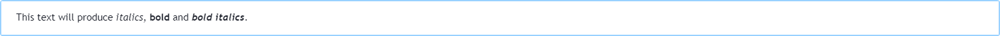
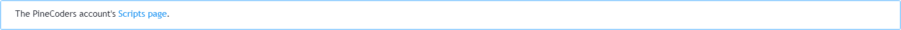
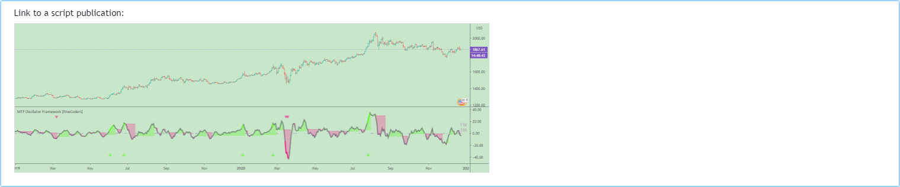
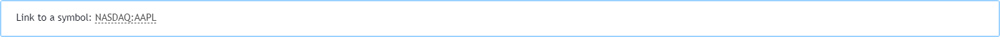
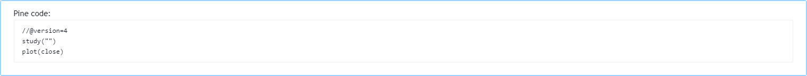

<!-- Global site tag (gtag.js) - Google Analytics -->
<script async src="https://www.googletagmanager.com/gtag/js?id=UA-147975914-1"></script>
<script>
  window.dataLayer = window.dataLayer || [];
  function gtag(){dataLayer.push(arguments);}
  gtag('js', new Date());

  gtag('config', 'UA-147975914-1');
</script>

[](https://www.pinecoders.com/)

# How PineCoders Write and Format Their Script Descriptions

### Table of Contents

- [Introduction](#introduction)
- [Our Building Blocks](#our-building-blocks)
- [Example of a Description](#example-of-a-description)
- [Tips](#tips)
<br><br>

## Introduction
This document explains how we write and format our script descriptions for publication on TradingView. We aim for our descriptions to **provide the most useful and legible information enabling users of our scripts to understand and use them advantageously**.

In order to achieve this, we:
- Order the content vertically by decreasing relevance to the understanding of our script.
- Aim to achieve maximal legibility while using minimal graphic/typographic attributes.
- Write the first sentence or two extra carefully, as they will be visible in the script's widget, which users will see before opening our script's page. We want that first sentence or two to adequately summarize our script.

## Our Building Blocks

### Markup
The following markup is available in script descriptions:

#### Bold and Italics
```
This text will produce [i]italics[/i], [b]bold[/b] and [b][i]bold italics[/i][/b].
```
and will look like this:

[](https://www.pinecoders.com/techniques/script_description/BoldItalics.png)

We try to use bold and italics sparingly. We use bold to mark emphasis and italics to name elements of our indicators that we refer to in its inputs or documentation.

#### URLs
Two types of URLs can be included. General URLs look like:
```
The PineCoders account's [url=https://www.tradingview.com/u/PineCoders/#published-scripts]Scripts page[/url].
```
and yield:

[](https://www.pinecoders.com/techniques/script_description/GeneralLink.png)

When you want to link to a TradingView publication such as a script or idea, or a chart snapshot created use:
```
Link to a script publication: [chart]https://www.tradingview.com/script/Wvcqygsx-MTF-Oscillator-Framework-PineCoders/[/chart]
```
to obtain:

[](https://www.pinecoders.com/techniques/script_description/LinkToPublication.png)

#### Symbols
You can link to symbol using:
```
Link to a symbol: `[symbol="NASDAQ:AAPL"]NASDAQ:AAPL[/symbol]`  
```
which will look like this:

[](https://www.pinecoders.com/techniques/script_description/LinkToASymbol.png)

#### Pine code blocks
You can include Pine code in monospace blocks by using:
```
Pine code:[pine]//@version=4
study("")
plot(close)[/pine]
```
to yield:

[](https://www.pinecoders.com/techniques/script_description/PineTags.png)

Notes:
- There is no inline equivalent for a monospace tag.
- Some character combinations in Pine code will be interpreted and garbled in the parser's output. Be sure to test the output of your code blocks in private descriptions before publishing them.

#### Bulleted lists

Bulleted lists:
```
[list]
[*]Item 1
[*]Item 2
[/list]
```

### Special Characters

We use a few different [Unicode space characters](http://jkorpela.fi/chars/spaces.html) to indent and align our text:
- Em space, U+2003, ( )
- En Space, U+2002, ( )
- Thin space, U+2009, ( ) 

and:
- the "full block", U+2588, (█)

## Example of a Description
This is an example of a marked up description which you can use as is in an actual TradingView script publication. Copy/paste it in a private script publication's description to play around with it.

```
█ [b]OVERVIEW[/b]

Efficient Work measures the ratio of price movement from close to close ([i]resulting work[/i]) over the distance traveled to the high and low before settling down at the close ([i]total work[/i]). The closer the two values are, the more Efficient Work approaches its maximum value of +1 for an up move or -1 for a down move. When price does not change, Efficient Work is zero.

Higher values of Efficient Work indicate more efficient price travel between the close of two successive bars, which I interpret to be more significant, regardless of the move's amplitude. Because it measures the direction and strength of price changes rather than their amplitude, Efficient Work may be thought of as a sentiment indicator.


█ [b]CONCEPTS[/b]

This oscillator's design stems from a few key concepts.

[b]Relative Levels[/b]
Other than the centerline, relative rather than absolute levels are used to identify levels of interest. Accordingly, no fixed levels correspond to overbought/oversold conditions. Relative levels of interest are identified using:
 • A Donchian channel (historical highs/lows).
 • The oscillator's position relative to higher timeframe values.
 • Oscillator levels following points in time where a divergence is identified.

[b]Higher timeframes[/b]
Two progressively higher timeframes are used to calculate larger-context values for the oscillator. The rationale underlying the use of timeframes higher than the chart's is that, while they change less frequently than the values calculated at the chart's resolution, they are more meaningful because more work (trader activity) is required to calculate them. Combining the immediacy of values calculated at the chart's resolution to higher timeframe values achieves a compromise between responsiveness and reliability.

[b]Divergences as points of interest rather than directional clues[/b]
A very simple interpretation of what constitutes a divergence is used. A divergence is defined as a discrepancy between any bar's direction and the direction of the signal line on that same bar. No attempt is made to attribute a directional bias to divergences when they occur. Instead, the oscillator's level is saved and subsequent movement of the oscillator relative to the saved level is what determines the bullish/bearish state of the oscillator.

[b]Conservative coloring scheme[/b]
Several additive coloring conditions allow the bull/bear coloring of the oscillator's main line to be restricted to specific areas meeting all the selected conditions. The concept is built on the premise that most of the time, an oscillator's value should be viewed as mere noise, and that somewhat like price, it only occasionally conveys actionable information.


█ [b]FEATURES[/b]

[b]Plots[/b]
 • Three lines can be plotted. They are named [i]Main line[/i], [i]Line 2[/i] and [i]Line 3[/i]. You decide which calculation to use for each line:
   • The oscillator's value at the chart's resolution.
   • The oscillator's value at a medium timeframe higher than the chart's resolution.
   • The oscillator's value at the highest timeframe.
   • An aggregate line calculated using a weighed average of the three previous lines (see the [i]Aggregate Weights[/i] section of Inputs to configure the weights).
 • The coloring conditions, divergence levels and the Hi/Lo channel always apply to the Main line, whichever calculation you decide to use for it.
 • The color of lines 2 and 3 are fixed but can be set in the "Colors" section of Inputs.
 • You can change the thickness of each line.
 • When the aggregate line is displayed, higher timeframe values are only used in its calculation when they become available in the chart's history,
  otherwise the aggregate line would appear much later on the chart. To indicate when each higher timeframe value becomes available,
  a small label appears near the centerline.
 • Divergences can be shown as small dots on the centerline.
 • Divergence levels can be shown. The level and fill are determined by the oscillator's position relative to the last saved divergence level.
 • Bull/bear markers can be displayed. They occur whenever a new bull/bear state is determined by the "Main Line Coloring Conditions".
 • The Hi/Lo (Donchian) channel can be displayed, and its period defined.
 • The background can display the state of any one of 11 different conditions.
 • The resolutions used for the higher timeframes can be displayed to the right of the last bar's value.
 • Four key values are always displayed in the Data Window (fourth icon down to the right of your chart):
  oscillator values for the chart, medium and highest timeframes, and the oscillator's instant value before it is averaged.

[b]Main Line Coloring Conditions[/b]
 • Nine different conditions can be selected to determine the bull/bear coloring of the main line. All conditions set to "ON" must be met to determine the bull/bear state.
 • A volatility state can also be used to filter the conditions.
 • When the coloring conditions and the filter do not allow for a bull/bear state to be determined, the neutral color is used.

[b]Signal[/b]
 • Seven different averages can be used to calculate the average of the oscillator's value.
 • The average's period can be set. A period of one will show the instant value of the oscillator,
  provided you don't use linear regression or the Hull MA as they do not work with a period of one.
 • An external signal can be used as the oscillator's instant value. If an already averaged external value is used, set the period to one in this indicator.
 • For the cases where an external signal is used, a centerline value can be set.

[b]Higher Timeframes[/b]
 • The two higher timeframes are named [i]Medium timeframe[/i] and [i]Highest timeframe[/i]. They can be determined using one of three methods:
  • Auto-steps: the higher timeframes are determined using the chart's resolution. If the chart uses a seconds resolution, for example,
   the medium and highest resolutions will be 15 and 60 minutes.
  • Multiples: the timeframes are calculated using a multiple of the chart's resolution, which you can set.
  • Fixed: the set timeframes do not change with the chart's resolution.

[b]Repainting[/b]
 • Repainting can be controlled separately for the chart's value and the higher timeframe values.
 • The default is a repainting chart value and non-repainting higher timeframe values. The Aggregate line will thus repaint by default,
  as it uses the chart's value along with the higher timeframes values.

[b]Aggregate Weights[/b]
 • The weight of each component of the Aggregate line can be set.
 • The default is equal weights for the three components, meaning that the chart's value accounts for one third of the weight in the Aggregate.

[b]High Volatility[/b]
 • This provides control over the volatility filter used in the Main line's coloring conditions and the background display.
 • Volatility is determined to be high when the short-term ATR is greater than the long-term ATR.

[b]Colors[/b]
 • You can define your own colors for all of the oscillator's plots.
 • The default colors will perform well on both white and black chart backgrounds.

[b]Alerts[/b]
 • An alert can be defined for the script. The alert will trigger whenever a bull/bear marker appears in the indicator's display.
  The particular combination of coloring conditions and the display of bull/bear markers when you create the alert will thus determine when the alert triggers.
  Once the alerts are created, subsequent changes to the conditions controlling the display of markers will not affect the existing alert(s).
 • You can create multiple alerts from this script, each triggering on different conditions.

[b]Backtesting & Trading Engine Signal Line[/b]
 • An invisible plot named "BTE Signal" is provided. It can be used as an entry signal when connected to the [url=https://www.tradingview.com/script/dYqL95JB-Backtesting-Trading-Engine-PineCoders/]PineCoders Backtesting & Trading Engine[/url] as an external input.
  It will generate an entry whenever a marker is displayed.


█ [b]NOTES[/b]

• I do not know for sure if the calculations in Efficient Work are original. I apologize if they are not.
• Because this version of Efficient Work only has access to OHLC information, it cannot measure the total distance traveled through all of a bar's ticks, but the indicator nonetheless behaves in a manner consistent with the intentions underlying its design.

[b]For Pine coders[/b]
This code was written using the following standards:
 • The PineCoders [url=http://www.pinecoders.com/coding_conventions/]Coding Conventions for Pine[/url].
 • A modified version of the PineCoders [url=https://www.tradingview.com/script/Wvcqygsx-MTF-Oscillator-Framework-PineCoders/]MTF Oscillator Framework[/url] and [url=https://www.tradingview.com/script/90mqACUV-MTF-Selection-Framework-PineCoders-FAQ/]MTF Selection Framework[/url].
```

## Tips

### AutoHotkey macros

We use these AutoHotkey macros to help us with tags:

```
; ————— TV markup tags.
!b::SendInput [b]               ; bold open (ALT-B).
!+b::SendInput [/b]             ; bold close (SHIFT-ALT-B).
!i::SendInput [i]               ; itals open (ALT-I).
!+i::SendInput [/i]             ; itals close (SHIFT-ALT-I).
!l::SendInput [list]            ; list open (ALT-L).
!+l::SendInput [/list]          ; list close (SHIFT-ALT-L).
^!+l::SendInput [*]             ; list item (CTRL-SHIFT-ALT-L).
^#!Right::SendInput [pine]      ; Pine open tag (CTRL-WIN-ALT-RightArrow).
^#!Left::SendInput [/pine]      ; Pine close tag (CTRL-WIN-ALT-LeftArrow).
```
