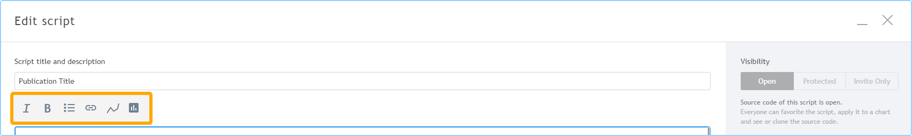
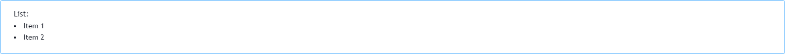
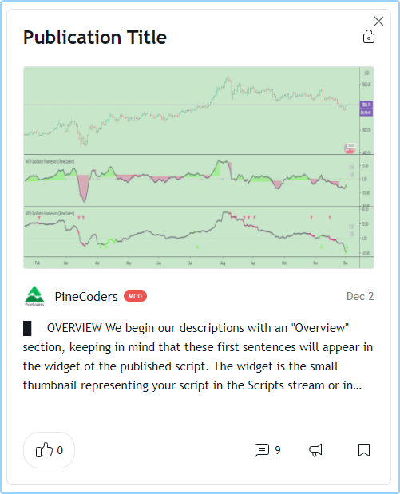
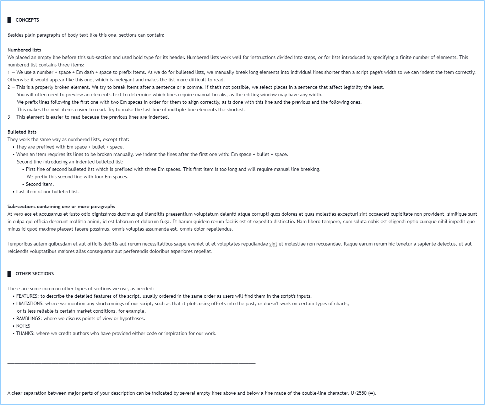
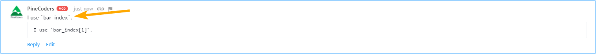

<!-- Global site tag (gtag.js) - Google Analytics -->
<script async src="https://www.googletagmanager.com/gtag/js?id=UA-147975914-1"></script>
<script>
  window.dataLayer = window.dataLayer || [];
  function gtag(){dataLayer.push(arguments);}
  gtag('js', new Date());

  gtag('config', 'UA-147975914-1');
</script>

[](https://www.pinecoders.com/)

# How PineCoders Write and Format Script Descriptions

### Table of Contents

- [Introduction](#introduction)
- [Our Building Blocks](#our-building-blocks)
- [A Description, Step by Step](#a-description-step-by-step)
- [Tips](#tips)


<br><br>
## Introduction
This document explains how we write and format our script descriptions for publication on TradingView. We aim for our descriptions to **provide the most useful and legible information enabling users of our scripts to understand and use them advantageously**.

In order to achieve this, we:
- Order the content vertically by decreasing relevance to the understanding of our script.
- Aim to achieve maximal legibility while using minimal graphic/typographic attributes.
- Write the first sentence or two extra carefully, as they will be visible in the script's widget, which users will see before opening our script's page. We want that first sentence or two to adequately summarize our script.

> Note that these recommendations are optimized for the rendering of script pages on desktops.  
Other devices may render script pages in ways these recommendations are not optimized for.

<br><br>
## Our Building Blocks

### Markup
The following markup is available in script descriptions. You can access all these tags except the Pine code block tags from the list of icons at the top of the "Publish script" or "Edit script" window:

[](https://www.pinecoders.com/techniques/script_description/TagIcons.png)

#### Bold and Italics
```
This text will produce [i]italics[/i], [b]bold[/b] and [b][i]bold italics[/i][/b].
```
and will look like this:

[](https://www.pinecoders.com/techniques/script_description/BoldItalics.png)

We try to use bold and italics sparingly. We use bold to mark emphasis and italics to name elements of our indicators that we refer to in its inputs or documentation.

#### URLs
Two types of URLs can be included. General URLs look like:
```
The PineCoders account's [url=https://www.tradingview.com/u/PineCoders/#published-scripts]Scripts page[/url].
```
and yield:

[](https://www.pinecoders.com/techniques/script_description/GeneralLink.png)

When you want to link to a TradingView publication such as a script or idea, or a chart snapshot created use:
```
Link to a script publication: [chart]https://www.tradingview.com/script/Wvcqygsx-MTF-Oscillator-Framework-PineCoders/[/chart]
```
to obtain:

[](https://www.pinecoders.com/techniques/script_description/LinkToPublication.png)

Note that this type of tag is not required; raw links to TV publications or snapshots will be interpreted the same way, so that:
```
Link to a script publication: https://www.tradingview.com/script/Wvcqygsx-MTF-Oscillator-Framework-PineCoders/
```
will yield the same output.

#### Symbols
You can link to a symbol which readers may click on to bring up a generic chart:
```
Link to a symbol: `[symbol="NASDAQ:AAPL"]NASDAQ:AAPL[/symbol]`  
```
which will look like this:

[](https://www.pinecoders.com/techniques/script_description/LinkToASymbol.png)

#### Pine Code Blocks
You can include Pine code in monospace blocks by using:
```
Pine code:[pine]//@version=4
study("")
plot(close)[/pine]
```
to yield:

[](https://www.pinecoders.com/techniques/script_description/PineTags.png)

Notes:
- There is no inline equivalent for a monospace tag. We use backticks to wrap Pine keywords or short Pine segments. They are not interpreted by the parser but provide a visual clue that the enclosed text is code:
    ```
    This sentence refers to the `bar_index` built-in variable.
    ```
- Some character combinations in Pine code blocks will be interpreted and garbled in the parser's output. Be sure to test the output of your code blocks in private descriptions before publishing them by copying the published result and trying to compile it in the Pine Editor.

#### Bulleted Lists

Lists are tagged like this:
```
List:
[list]
[*]Item 1
[*]Item 2
[/list]
```
and look like this:

[](https://www.pinecoders.com/techniques/script_description/Lists.png)

We don't like the smaller point size used for list items and prefer to build our own lists, as we explain in our example description.


### Special Characters

We use a few different Unicode characters to build our descriptions:
- Em space, U+2003 ( )
- Full block, U+2588 (█)
- Bullet, U+2022 (•)
- Em dash, U+2014 (—)


<br><br>
## A Description, Step by Step
We will now build an example description step by step. We begin with our "Overview" section:
```
█ [b]OVERVIEW[/b]

We begin our descriptions with an "Overview" section, keeping in mind that these first sentences will appear in the [i]widget[/i] of the published script. The [i]widget[/i] is the small thumbnail representing your script in the Scripts stream or in your user profile's "Scripts" tab. When users click on your script's [i]widget[/i], they open your script's [i]page[/i].


```
The above text will look like this in your script's page:

[](https://www.pinecoders.com/techniques/script_description/Overview.png)

and like this in your script's widget:

[](https://www.pinecoders.com/techniques/script_description/ScriptWidget.png)

Note:
- We prefix section titles with a full block and an Em space: (█ ).
- We use all caps for the title and the bold attribute.
- We follow section titles with an empty line.
- We end sections with two empty lines to provide visual separation between sections. This entails that we never use two empty lines within sections.

This is the rest of our example description:
```
█ [b]CONCEPTS[/b]

Besides plain paragraphs of body text like this one, sections can contain:

[b]Numbered lists[/b]
We placed an empty line before this sub-section and used bold type for its header. Numbered lists work well for instructions divided into steps, or for lists introduced by specifying a finite number of elements. This numbered list contains three items:
1 — We use a number + space + Em dash + space to prefix items. As we do for bulleted lists, we manually break long elements into individual lines shorter than a script page's width so we can indent the item correctly. Otherwise it would appear like this one, which is inelegant and makes the list more difficult to read.
2 — This is a properly broken element. We try to break items after a sentence or a comma. If that's not possible, we break sentences where pauses will affect legibility the least. 
  You will often need to preview an element's text to determine which lines require manual breaks, as the editing window may have any width.
  We prefix lines following the first one with two Em spaces in order for them to align correctly, as is done with this line, the previous and the following ones. 
  This makes the next items easier to read. Try to make the last line of multiple line elements the shortest.
3 — This element is easier to read because the previous lines are indented.

[b]Bulleted lists[/b]
Bulleted lists work the same way as numbered lists, except that:
 • They are prefixed with Em space + bullet + space.
 • When an item requires its lines to be broken manually, we indent the lines after the first one with two Em spaces.
  Second line introducing an indented bulleted list:
   • First line of second bulleted list which is prefixed with three Em spaces. This first item is too long and will require manual line breaking.
    We prefix this second line with four Em spaces.
   • Second item.
 • Last item of our bulleted list.

[b]Sub-sections containing one or more paragraphs[/b]
At vero eos et accusamus et iusto odio dignissimos ducimus qui blanditiis praesentium voluptatum deleniti atque corrupti quos dolores et quas molestias excepturi sint occaecati cupiditate non provident, similique sunt in culpa qui officia deserunt mollitia animi, id est laborum et dolorum fuga. Et harum quidem rerum facilis est et expedita distinctio. Nam libero tempore, cum soluta nobis est eligendi optio cumque nihil impedit quo minus id quod maxime placeat facere possimus, omnis voluptas assumenda est, omnis dolor repellendus.

Temporibus autem quibusdam et aut officiis debitis aut rerum necessitatibus saepe eveniet ut et voluptates repudiandae sint et molestiae non recusandae. Itaque earum rerum hic tenetur a sapiente delectus, ut aut reiciendis voluptatibus maiores alias consequatur aut perferendis doloribus asperiores repellat.


█ [b]OTHER SECTIONS[/b]

These are some common other types of sections we use, as needed. Keep section titles short:
 • FEATURES: to describe the detailed features of the script, usually arranged in the same order as users will find them in the script's inputs.
 • HOW TO USE
 • LIMITATIONS: where we mention any shortcomings of our script, such as that it plots using offsets into the past, or doesn't work on certain types of charts, 
  or is less reliable in certain market conditions, for example.
 • RAMBLINGS: where we discuss points of view or hypotheses.
 • NOTES
 • THANKS: where we credit authors who have provided either code or inspiration for our work. We will often mention authors by using a hyperlink to their scripts page, as when we thank the Maestro, [url=https://www.tradingview.com/u/RicardoSantos/#published-scripts]RicardoSantos[/url].


═════════════════════════════════════════════════════════════════════════


A clear separation between major parts of your description can be indicated by several empty lines above and below a line made of the double-line character, U+2550 (═), which renders without gaps in the Trebuchet font TradingView uses.
```

This is what it produces once published:

[](https://www.pinecoders.com/techniques/script_description/RestOfDescription.png)


<br><br>
## Tips

### Write Descriptions That Will Age Well
Because original script descriptions cannot be modified after the initial grace period of 15 minutes, refrain from including non-critical details that may change in the future. For example, when this does not jeopardize the usability of your script, you can omit a list of dropdown menu items (like a list of colors) and only explain what that input field does. Non-critical default periods or lookback lengths used in inputs are another example of information that may change as your script evolves, and which you may be glad not to have mentioned in your original description when they do change.

### Charts or Other Indicators
When including links that will render as an image, first introduce the image so that it does not appear out of the blue. Prepare your reader for the image they are about to see, present the image, then describe its contents.

### Pine's History-Referencing Operator Is Stripped From Text Outside Block Codes
Be aware that references to past values of variables will be eliminated by the parser if they are not in Pine code block tags. This is true for both descriptions and comments. This text:
```
I use `bar_index[1]`.
[pine]I use `bar_index[1]`.[/pine]
```
will yield:

[](https://www.pinecoders.com/techniques/script_description/HistoryReferencing.png)

### Multilingual Descriptions
When writing multilingual descriptions, House rules require that you begin with English. To indicate to readers of another locale that another language is available, it is good practice to mention this in the very first line of your description. If a French description was available after the first one in English, you could use:

```
[Une description en français suit l'anglais.]
```
which says "A French description follows the English one."

### Tags in Comments
Note that the only tags interpreted in comments posted on TradingView publications are links to TV publications and chart snapshots, and Pine code block tags. As in descriptions, links to TV publications and snapshots do not require using `[chart]...[/chart]` tags; you can simply paste the link in the comment, which will render as an image.

### AutoHotkey Macros
We use these AutoHotkey macros to help us with tags:

```
; ————— TV markup tags.
!b::SendInput [b]               ; bold open (ALT-B).
!+b::SendInput [/b]             ; bold close (SHIFT-ALT-B).
!i::SendInput [i]               ; itals open (ALT-I).
!+i::SendInput [/i]             ; itals close (SHIFT-ALT-I).
!l::SendInput [list]            ; list open (ALT-L).
!+l::SendInput [/list]          ; list close (SHIFT-ALT-L).
^!+l::SendInput [*]             ; list item (CTRL-SHIFT-ALT-L).
^#!Right::SendInput [pine]      ; Pine open tag (CTRL-WIN-ALT-RightArrow).
^#!Left::SendInput [/pine]      ; Pine close tag (CTRL-WIN-ALT-LeftArrow).
```
